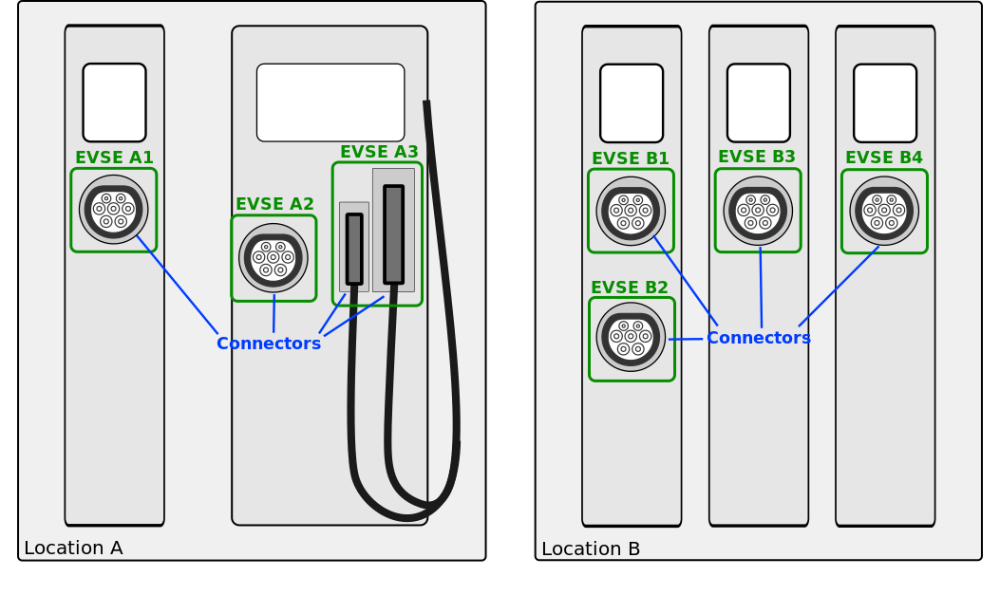

# Charging topology

The charging topology, as relevant to the eMSP, consists of three entities:

* _Connector_ is a specific socket or cable available for the EV to make use of.
* _EVSE_ is the part that controls the power supply to a single EV in a single session. An EVSE may provide multiple
  connectors but only one of these can be active at the same time.
* _Location_ is a group of one or more EVSEs that belong together geographically or spatially.

A Location is typically the exact location of one or more EVSEs, but it can also be the entrance of a parking garage or
a gated community. It is up to the CPO to use whatever makes the most sense in a specific situation. Once arrived at the
location, any further instructions to reach the EVSE from the Location are stored in the EVSE object itself (such as the
floor number, visual identification or manual instructions).
