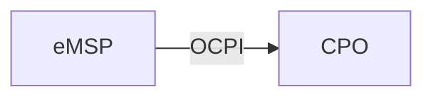

# Peer-to-peer

The simplest topology is a bilateral connection: peer-to-peer between two platforms,
and in the most simple version each platform only has 1 role.

```mermaid
graph LR
    eMSP --OCPI--> CPO
```
