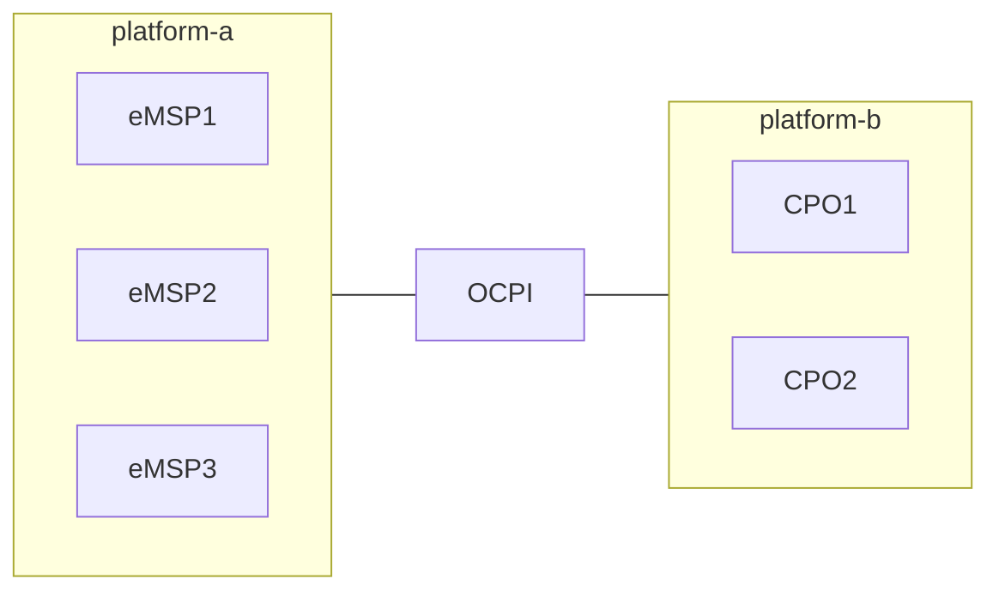

# Peer-to-peer multiple the same roles

Some parties provide for example CPO or eMSP services for other companies. So the platform hosts multiple parties with
the same role. This topology is a bilateral connection: peer-to-peer between two platforms, and both platforms can have
multiple roles.

