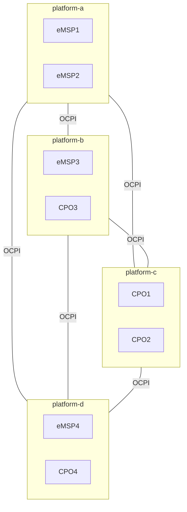

# Peer-to-peer mixed roles

Some parties have dual roles, or provide them to other parties and then connect to other companies that do the same.
This topology is a bilateral connection: peer-to-peer between two platforms,
and both platforms have multiple different and also the same roles.

