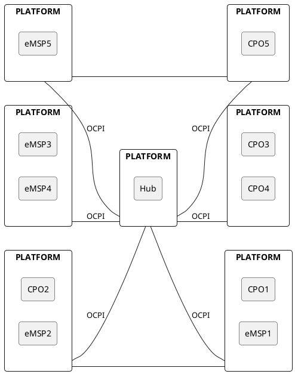

# Platforms via Hub and direct

Not all Platforms will only communicate via a Hub.
There might be different reasons for Platforms to still have peer-to-peer connections.
The Hub might not yet support new functionality.
The Platforms use a custom module for some new project, which is not supported by the Hub.
etc.

