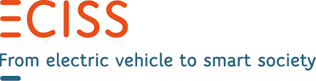

# Introduction and background

The Open Charge Point Interface (OCPI) enables a scalable, automated EV roaming setup between Charge Point Operators and
e-Mobility Service Providers. It supports authorization, charge point information exchange (including live status
updates and transaction events), charge detail record exchange, remote charge point commands and the exchange of
smart-charging related information between parties.

It offers market participants in EV an attractive and scalable solution for (international) roaming between networks,
avoiding the costs and innovation-limiting complexities involved with today's non-automated solutions or with central
roaming hubs. It helps to enable EV drivers to charge everywhere in a fully-informed way, helps the market develop
quickly, and allows market players to execute their business models in the best way.

What does it offer (main functionality):

* A good roaming system (for bilateral usage and/or via a hub).
* Real-time information about location, availability and price.
* A uniform way of exchanging data (Notification Data Records and Charge Data Records) before, during and after the
  transaction.
* Remote mobile support to access any Charge Point without pre-registration.

An international group of over 400 companies from all over the world already supports OCPI. Initiators are
[EV Box](https://evbox.com), New Motion, [ElaadNL](https://elaad.nl), [BeCharged](https://www.becharge.es),
[GreenFlux](https://www.greenflux.com) and [Last Mile Solutions](https://www.lastmilesolutions.com).

Other participants include: [Next Charge](https://nextcharge.app), [Freshmile](https://www.freshmile.com),
[E55C](https://www.e55c.com), [GIREVE](https://www.gireve.com), OCN, [ihomer](https://ihomer.nl),
[Rexel](https://www.rexel.com), [Stromnetz Hamburg](https://www.stromnetz-hamburg.de), [Enervalis](https://enervalis.com),
[Place to plug](https://placetoplug.com), [Plugsurfing](https://plugsurfing.com), [Ecomovement](https://www.eco-movement.com),
[Allego](https://www.allego.eu), [Gronn Kontakt Norway](https://no.mer.eco), [ENIO](https://www.enio-management.com),
[Fastned](https://fastnedcharging.com), [AvantIT](https://www.avantit.no), [Chargemap](https://chargemap.com),
[Involtum](https://involtum.com), Capitol Region Denmark, [Vattenfall](https://group.vattenfall.com),
[EON](https://www.eonenergy.com), ECY Conseil Emeric Chardiny, [Eneco Mobility](https://www.eneco-emobility.com),
[Google](https://abc.xyz), [Jedlix](https://www.jedlix.com), MTC, Smartlab, [Sodetrel](https://www.izivia.com),
[XXIMO](https://www.xximo.nl), Mnemonics, [Share & Charge](https://shareandcharge.com), Service House, [Alfen / ICU](https://alfen.com),
PI2 Consultancy, [Pitpoint](https://www.pitpointcleanfuels.com), [Blue Corner](https://www.bluecorner.nl), Building Energy,
Chargestorm, [Chargepoint](https://www.chargepoint.com), [ESARJ](https://esarj.com), [Chargelab.co](https://www.chargelab.co),
MUVEXT, [Next Green Car](https://www.nextgreencar.com) / [Zap Map](https://www.zap-map.com), [Be Mo Tech](https://be-mo.io),
[Parking Eagle](https://www.parkingeagle.com), GraphDefined, [Chargecloud](https://www.chargecloud.de),
Rutgerplantengaconsulting, [Everon](https://everon.io), [Tanqyou](https://www.tanqyou.com),
[Electric Vehicle Association Scotland (EVA NCS)](https://www.eva.scot), [EV-Tech](https://evtech.us),
[Plugin Power](https://plugin-power.com), [Last Mile Solutions](https://www.lastmilesolutions.com),
[BIA Power](https://www.biapower.io), [IBIL](https://www.ibil.es), [Gridscape](https://grid-scape.com),
[Maxem](https://maxem.io), [Virta](https://www.virta.global), EasyCharger, Total EV Charge, [Gowithflow](https://gowithflow.io),
EKAROS, [Rexel US](https://www.rexelusa.com), [Stekker App](https://www.stekker.com), Travelcard,
[Emobility Consulting](http://www.emobilityconsulting.com).

The EVRoaming foundation supported by the Netherlands Knowledge Platform for Charging Infrastructure (NKL)
facilitates and coordinates this protocol to guarantee progress and ensure development and results.

This document describes a combined set of standards based on the work done in the past. Next to that,
the evolution of these standards and their use are taken into account and some elements have been updated to match
nowadays use.

*OCPI is developed with the support of:*

evRoaming4EU project and its partners:

ECISS project and its partners:

The latest version of this specification can be found here: [https://github.com/ocpi/ocpi](https://github.com/ocpi/ocpi)
