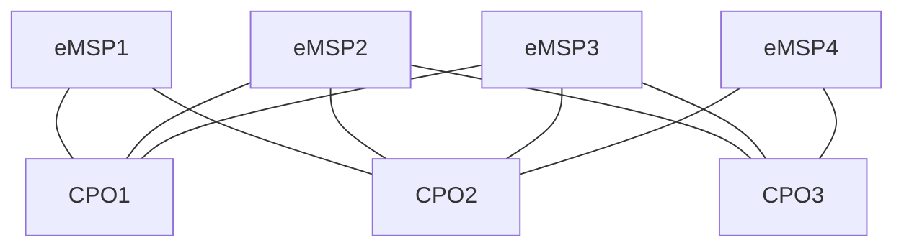

# Multiple peer-to-peer connections

A more real-world topology where multiple parties connect their platforms
and each platform only has 1 role.
(Not every party necessarily connects with all the other parties with the other role).

