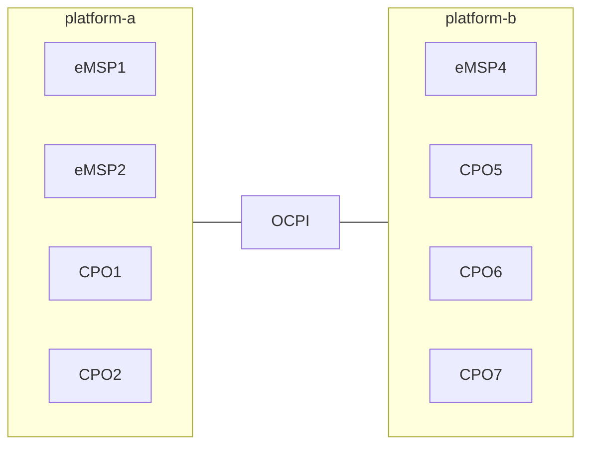

# Peer-to-peer dual roles

Some parties have dual roles, most of the companies are CPO and eMSP.
This topology is a bilateral connection: peer-to-peer between two platforms,
and both platforms have the CPO and the eMSP roles.

