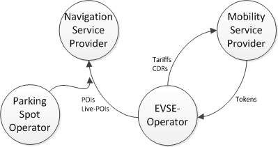

# CH-Partner Interface description

The interfaces between the system of the Clearing House and systems of
the different partners consist of the six following components:

* Exchange of Authorisation Data (Roaming Authorisations, 
  RoamingAuthorisationInfo)
* Exchange of Charge Data, the raw billing data (Charge Detail 
  Records, CDRInfo)
* Exchange of Charge Point Information (Static and live POI data, 
  ChargePointInfo)
* Exchange of Tariff Information (TariffInfo)
* Single Authorization Requests (Single-Token-Requests)
* Exchange of Parking Spot Information (Static and live data)

From the data flow perspective, each market role is a source or a sink
for certain data types. The figure below gives an overview of
the exchanged data types, their direction and their particular
originating and consuming market role.

The exchange of data takes place via standardized web services.

