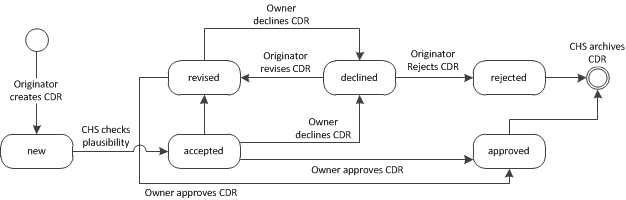

# Exchange Charge Data

The exchange of charge data is be done by sending records containing 
all billing information from the EVSE-Operator to the corresponding
EVSP. The data set is called Charge Detail Record (CDR). Each CDR 
contains a status value that reflects the processing state of the 
record within the clearing house roaming connection. The figure in the
next section illustrates the status flow for each CDR.

## CDR Validation Process

In bilateral agreed intervals, the EVSE-Operator or CDR-"Originator" 
sends all relevant CDRs to the Clearing House. A basic plausibility 
check is performed by the Clearing House and determines if the CDRs can 
be accepted. Implausible CDRs will directly be sent back to the 
CDR-"Originator" and can be adjusted. A corrected version of the CDR 
can again be uploaded to the Clearing House with the next call. Already 
uploaded CDRs will have the status *new* set by the Clearing House. 
Plausible CDRs will be marked as *accepted* and forwarded to the EV 
Service Provider or CDR-"Owner" for approval.
The CDR-"Owner" downloads (in bilaterally agreed intervals) the list of 
CDRs from all providers. After an internal validation check in the 
backend, the EVSP uploads a list of approved and declined CDRs to the 
Clearing House. Approved CDRs will be marked as such and their status 
is set to *approved*. These CDRs will then be archived and will not
be included in the standard GetCDRs. Declined CDRs will be marked as 
*declined* and will then be available for download by the EVSE Operator.
They now have the option to either re-upload a reworked CDR as *revised*
using the same CDR-ID or finally confirm the affected CDRs as *rejected*,
foregoing any further claims on that charging process.

## Upload Charge Data Records

Local roaming charge data records are sent from the CMS to the CHS. The
upload has to be done in the following way:

* CMS sends the AddCDRs.req PDU.
* CHS responds with an AddCDRs.conf PDU.

## Process Charge Data Records

Incoming roaming charge data records, held at the CHS are sent from the
CHS to the MDM. Note that only CDRs that concern the particular EVSP are
sent. The download has to be done in the following way:

* MDM sends GetCDRs.req PDU.
* CHS responds with a GetCDRs.conf PDU.
* MDM confirms or declines individual CDRs by sending ConfirmCDRs.req PDU.
* CHS responds with a ConfirmCDRs.conf PDU.
 
Furthermore, the CMS may download declined CDRs and attempt to fix any
issues there were by re-uploading the CDRs as "revised" or to finally
reject them (forego payment) by setting their status to "rejected".
 
* CMS may send the CheckCDRs.req PDU.
* CHS responds with CheckCDRs.conf PDU according to the status provided in the request.
* CMS may revise CDRs by sending AddCDRs.req PDU.
* CHS responds with an AddCDRs.conf PDU.
* CMS may reject individual CDRs by sending AddCDRs.req PDU.
* CHS responds with a AddCDRs.conf PDU.

### Implementation
All CDRs stay in the download queue (GetCDRs without explicitly stating the status)
until their successful download was confirmed by a call to ConfirmCDRs.req.
Declined CDRs may be handled in a separate process as described above.

**Note:** all CDR-IDs uploaded by OCHP 1.4 will now contain the CPO-ID
for the first five characters and will thus be treated as unique across
the entire eCHS. CDRs uploaded via OCHP 1.3 are only EVSE-unique, however,
and do not necessarily contain the CPO-ID as the first five characters.
