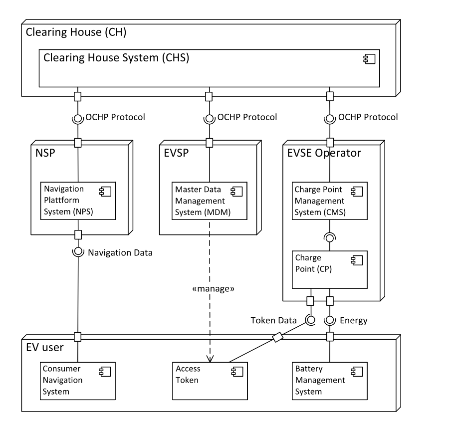
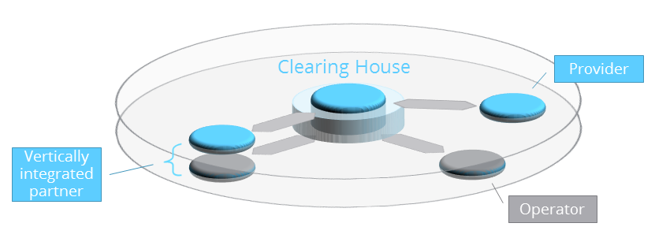

# Clearing House

The basic idea of a Clearing House is to enable the connected partners
to roam with each other. The goal of roaming is that EV users can
easily charge their electric vehicle on every charging station of
different EVSE operators. With roaming support, provided by the Clearing
House, the complexity of relationships can be reduced: from many-to-many
bilateral partner connection towards a one-to-many connection between
the Clearing House and the partners. The figure illustrates the overall 
system overview of all partners with their systems and the clearing 
house system with the EV user as service consumer.

A different view to the implementation of the described role model gives
figure below. The clearing house provides here a central
connection between the operator layer — where the charging stations are
located — and the provider layer — where the users are. Direct
connections of two roaming partners on the same layer are not necessary.
Each partner operates a single connection to the clearing house from
through which they get connected to multiple partners on the other
layers.
Some of the partners might take two or more roles on different layers.
For each of their roles a connection to the clearing house is necessary
to connect to other roaming partners. The internal data connection
between the distinct roles of one single partner might or might not be
routed through the clearing house.
For the sake of simplification only two layers are shown in this figure.
The same principles apply to the navigation service layer. Also other 
additional clearing houses could exist in this model.

