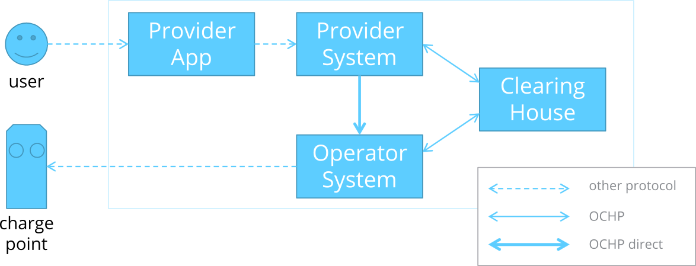

# OCHPdirect Extension

Starting with Protocol Version 1.3, OCHP offers the possibility to 
open a _direct_ communication between two roaming partners. The 
following figure illustrates the additional data path.

The direct communication between operators and providers allows the 
implementation of fundamental new use cases between two roaming 
partners. Those use cases are:

* **Remote Start:** A user starts a charging process at an operator‘s 
  charge pole by using a provider‘s app. They are starting the process 
  from a – of the operator's point of view – remote service.
* **Remote Stop:** A user stops a charging process at an operator‘s 
  charge pole by using a provider‘s app (that was remotely started).
* **Live Info:** A user requests information about a charging process 
  at an operator’s charge pole by using a provider’s app (from which 
  the process was started).
* **Charge Event:** A user gets informed by a provider’s app about 
  status changes of a charging process at an operator’s charge pole, 
  even if it wasn't started remotely.
* **Remote Control:** A user controls a charging process at an 
  operator‘s charge pole that was not remotely started by using a 
  provider‘s app.
* **Remote Action:** A user triggers advanced and not charging process 
  related actions at a charge point or charging station of an operator.

## Definition of OCHP direct

Being an extension to the pure OCHP, the messages and data types used 
for OCHPdirect are defined in a [seperate document](/docs/protocols/ochp/ochp_direct/intro).
Within the current document, only the extension to OCHP is described.
The complete description of the functionality and implementation of
_OCHPdirect_ can be found in its seperate documentation.
