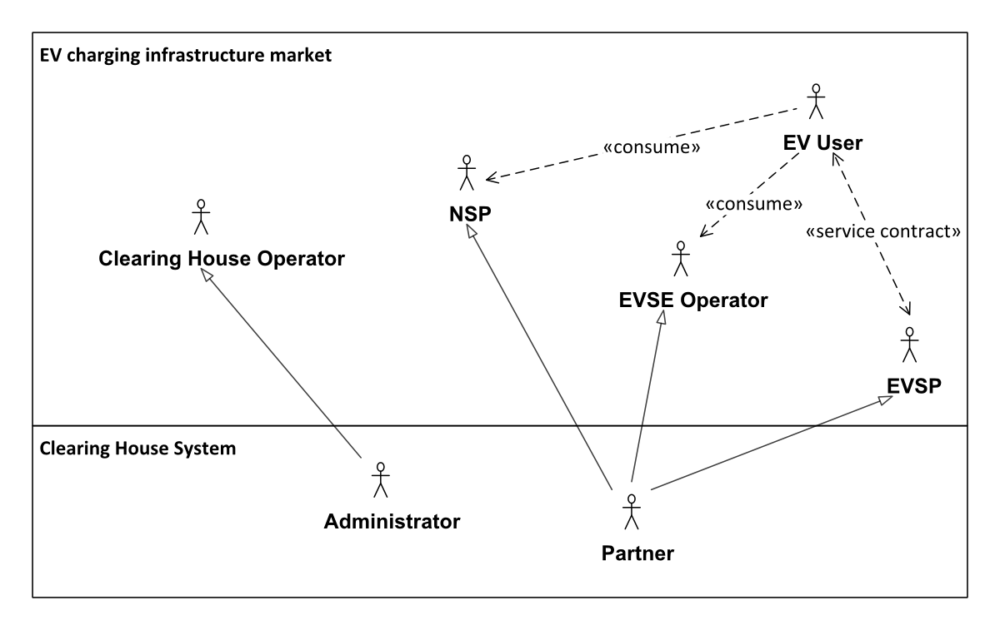
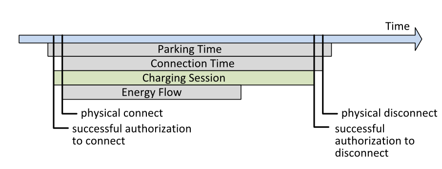
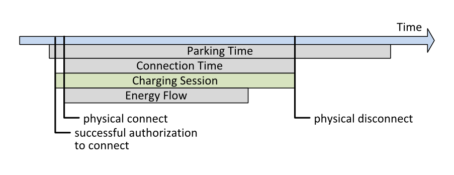

# Primary Stakeholders Electric Vehicles

The purpose of the Open Clearing House Protocol is to connect market
actors in the field of electric mobility charging infrastructure. The
different relevant market roles are as shown in the market overview 
figure:

* The *EV user* of the overall system - a human charging an electric 
  car via the connected infrastructure, having a direct or indirect 
  service contract with an EVSP.
* The *EVSP* (Electric Vehicle Service Provider) - granting access to 
  charging stations and thus offering services to the contracted EV 
  user. The service offer is supported by the market roles EVSE 
  Operator and NSP.
* The *EVSE Operator* (Electric Vehicle Supply Equipment Operator) - 
  operating charging stations.
* The *NSP* (Navigation Service Provider) - offering relevant 
  navigation services to the EV user.
* The *PSO* (Parking Spot Operator) - owning and/or operating the parking
  spots that allow access to the charging infrastructure owned/operated
  by the EVSE Operator.
* The *Clearing House Operator* - running a software platform called 
  Clearing House to enable data exchange between the market roles (2) 
  to (4).

In the context of a clearing house system the market roles (2) to (4)
are referred as *partners*, the role (5) is called
*administrator*. The role (1) is not explicitly known to the system.
The role of a clearing house in terms of this document is to facilitate
the exchange of roaming authorisations, charge point information and
charge detail records between the market participants. Other clearing
houses and local networks might serve the same purpose on a different
scale/region or with different partners. The connection to other
clearing houses is out of scope in the current state. The market roles
are defined in the following section. One company however might fulfil
one or more market roles. The contracts between each actor and the data
routing are part of the clearing house's business logic and out of scope
for this protocol description.

## Electric Vehicle User (EV User)

The EV user has a direct or indirect service contract with an EVSP who
grants access to a specified charging infrastructure of one or more EVSE
Operators. The EV users identify their selves via an access token issued
by the EVSP.

## Electric Vehicle Service Provider (EVSP)

The EVSP operates as a contract party for the EV user. The EV Service
Provider takes care of the EV user authentication and billing processes.
The EV Service Provider provides the EV-customer authorization tokens
(i.e. RFID-card, Certificates, ... ) that give authorisation to use
the charging stations of contracted EVSE Operators.

## Electric Vehicle Supply Equipment Operator (EVSE Operator)

The EVSE operator operates as contract party for the EVSP. The charging
stations (EVSE) of the EVSE operator are accessible by a specified set
of EV users of the contracted EVSPs. The EVSP pays the EVSE operator for
the charging services received by its contracted EV users.

## Navigation Service Provider (NSP)

The NSP offers service towards the EV user for searching, locating and
routing to EVSEs of the contracted EVSE operators. It therefore may have
contracts with EVSE operators or EVSPs.

## Parking Spot Operator (PSO)

The PSO offers multiple services to the Operator as well as the EV Driver and
NSP. They offer access to a parking spot associated with an EVSE to the
EV driver and sometimes the location for the EVSE to the EVSE-Op. Furthermore,
they may operate services that allow detailed tracking of the occupation
of single parking spots, thus enhancing Operator-data sent to an NSP.

## Charging Session

A charging session in the scope of this document is defined from the
successful authorization of the user at the charge point. It is
considered active until the successful authorized stop command was
executed (first figure below) or the car was disconnected from the 
charge point manually (second figure below). This is considered a 
forced unauthorized ending.

