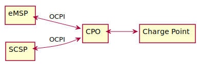

# Smart Charging Topologies

There are different Smart Charging Topologies possible. Which topology can be used depends on the contracts between
different parties.

:::note
Care has to be taken to prevent mixing the different topologies. When multiple parties start sending Charging Profiles,
the resulting charging speed might be unpredictable. In case of OCPP Charge Points, the result will be the minimum of
all the Charging Profiles, resulting in a slower than needed charging speed.
:::

## The eMSP generates ChargingProfiles

The most straight forward topology, the eMSP generates ChargingProfiles for its own customers, no SCSP is involved. The
eMSP *owns* the customer, so if the eMSP knows that its customer agrees with the eMSP manipulating the charging speed,
the eMSP is free to do this.

| Interface | Role |
|-----------|------|
| Sender    | eMSP |
| Receiver  | CPO  |

## The eMSP delegated Smart Charging to SCSP

In the topology, the eMSP has delegated the generation of ChargingProfiles to a SCSP. For this, the eMSP and SCSP have
agreed to use OCPI as the interface.

The eMSP *owns* the customer, so if the eMSP knows that its customer agrees with the eMSP manipulating the charging
speed, the eMSP is free to do this. The eMSP can forward OCPI
[Session](https://ocpi.dev) Objects to the SCSP. the SCSP can act on the
received/updated [Session](https://ocpi.dev) Objects, by sending Charging Profile
commands via the eMSP to the CPO.

The eMSP and SCSP have to take into account that they have to oblige to local privacy laws when exchanging information
about eMSPs customers.

From the CPO point of view, this topology is similar to the one above, the CPO will not know the difference.

| Connection  | Interface | Role |
|-------------|-----------|------|
| SCSP - eMSP | Sender    | SCSP |
| SCSP - eMSP | Receiver  | eMSP |
| eMSP - CPO  | Sender    | eMSP |
| eMSP - CPO  | Receiver  | CPO  |

## The CPO delegated Smart Charging to SCSP

In this topology, the CPO has delegated the generation of ChargingProfiles to a SCSP. For this, the CPO and SCSP have
agreed to use OCPI as the interface.

The CPO *owns* the EVSE on which charging happens. As the CPO does not *own* the customers, the CPO needs to make sure
the EV driver knows that the charging speed might not be the maximum the driver has expected, this could be something as
simple as a sticker on the Charge Point, or might even be part of the tariff text.

The CPO might generate ChargingProfiles themselves, but as OCPI is then not used this is not part of this document.

The CPO can forward OCPI [Session](https://ocpi.dev) Objects to the SCSP. the SCSP can
act on the received/updated [Session](https://ocpi.dev) Objects, by sending Charging
Profile commands to the CPO.

The CPO and SCSP have to take into account that they have to oblige to local privacy laws when exchanging information
about eMSPs customers.

In this topology, the eMSP is not aware that the CPO is using OCPI to receive Charging Profiles from the SCSP.

| Interface | Role |
|-----------|------|
| Sender    | SCSP |
| Receiver  | CPO  |
