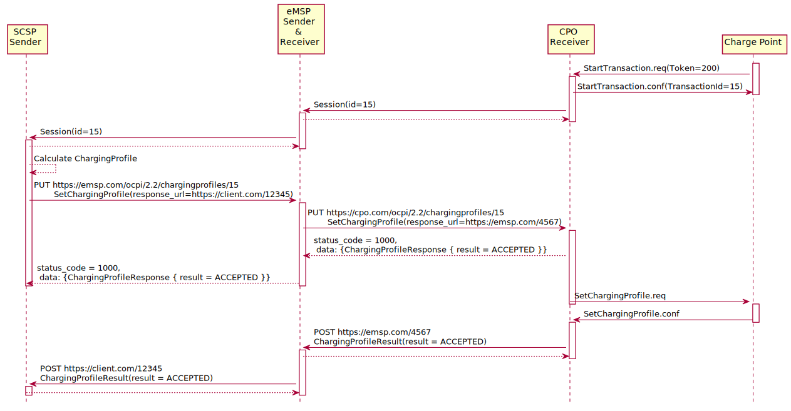
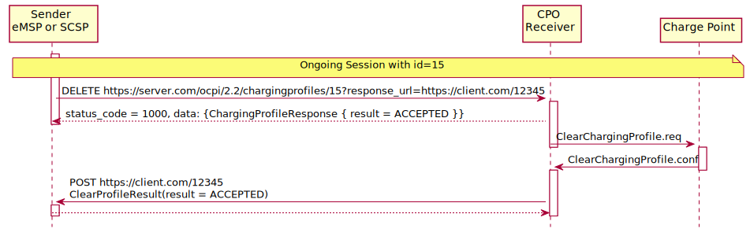
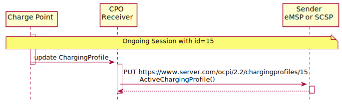
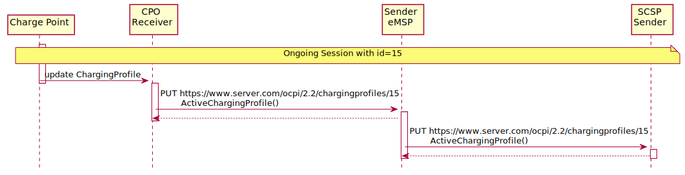

# Flow

The ChargingProfile creation is a request to activate a charging profile on a running charging session.

Most Charge Points are hooked up to the internet via a relative slow wireless connection. To prevent long blocking
calls, the ChargingProfile module is designed to work asynchronously. (similar to the
[`Commands`](https://ocpi.dev) module.

The Sender (Typically SCSP) sends a request to a Receiver (Typically CPO), via the Receiver interface. The Receiver
checks if it can send the request to a Charge Point and will respond to the request with a status, indicating if the
request can be sent to a Charge Point.

The Receiver sends the requested command (via another protocol, for example: OCPP) to a Charge Point. The Charge Point
will respond if it understands the command and will try to execute the command. This response doesn't always mean that
the ChargingProfile will be executed. The CPO will forward the result in a new POST request to the Sender (Typically
SCSP) ChargingProfile interface.

The Sender (Typically SCSP) can send the Charging Profile to the EVSE via the CPO by using the [CPO PUT
method](https://ocpi.dev) for an ongoing session. The Sender can request the current profile the
EVSE has calculated, based on different inputs, and is planned to be used for the ongoing session by calling the [CPO
GET method](https://ocpi.dev). The Sender has the ability to remove the Charging Profile for the
session by calling the [CPO DELETE method](https://ocpi.dev)

When the Sender has (at least once) successfully sent a Charging Profile for an ongoing charging session, the Receiver
(Typically CPO) SHALL keep the Sender updated with changes to the ActiveChargingProfile of that Session. If the Receiver
is aware of any changes, he notifies the Sender by calling the [MSP PUT method](https://ocpi.dev).
The changes might be triggered by the CPO sending additional Charging Profiles, or the some local limit being applied to
the Charge Point, and the Charge Point notifies the CPO of the Changes.

The Receiver can cancel/remove an existing ChargingProfile, it can let the eMSP know by calling the [MSP PUT
method](https://ocpi.dev)

For calculating optimum ChargingProfiles it might be useful for the eMSP or SCSP to know the ChargingProfile that the
Charge Point has planned for the Session: ActiveChargingProfile. The ActiveChargingProfile might differ from
ChargingProfile requested via OCPI. There might be other limiting factors being taken into account by the CPO and or
Charge Point, that limit the ChargingProfile. The ActiveChargingProfile profile can be requested by the Sender by
calling the [CPO GET method](https://ocpi.dev) on the Charging Profile Receiver interface. The CPO
will then ask the Charge Point for the planned ActiveChargingProfile. When that is received it is forwarded to the URL
given by the eMSP or SCSP.

The CPO can limit the amount of request that can be done on the Charging Profiles interface, this too prevent creating a
too high load or data usages. To do this the CPO can reject a request on the Charging Profile Receiver interface be
responding with: TOO_OFTEN.

If the Sender (typically eMSP or SCSP) wants to have a reference between the calls sent to the Receivers interface and
the asynchronous result received from the Charge Point via the CPO, the Sender can make some unique identifier part of
the\`response_url\` that is part of every method in the Receiver interface. The Receiver will call this URL when the
result is received from the Charge Point. The Sender can then match the unique identifier from the URL called with the
request.

## Example of setting/updating a ChargingProfile by the Sender (typically the SCSP or eMSP)

When a new [Session](https://ocpi.dev) is started, or when an update to an existing
[Session](https://ocpi.dev) is available, the CPO sends the Session object to the eMSP
or SCSP. The eMSP or SCSP calculates a Charging Profile and sends it to the CPO by calling the Charging Profiles
[PUT](https://ocpi.dev) method on the Receiver interface.

The CPO responds to the eMSP or SCSP, the response body will contain the response to the request, acknowledging the
request was understood and can be forwarded to the Charge Point.

The CPO sends the requests to the Charge Point. When the CPO receives a response from the Charge Point, that result is
sent to the eMSP or SCSP by call the [POST](https://ocpi.dev) method, on the URL provided by the
eMSP of SCSP in the [PUT](https://ocpi.dev) request, this call will contain a
[ChargingProfileResult](https://ocpi.dev) Object.

## Example of a setting/updating a ChargingProfile by the SCSP via the eMSP

When a new Session is started, the CPO sends the Session object to the eMSP, the eMSP forwards the Session object to the
SCSP.

When a new [Session](https://ocpi.dev) is started, or when an update to an existing
[Session](https://ocpi.dev) is available, the CPO sends the Session object to the
eMSP. The eMSP forwards the [Session](https://ocpi.dev) Object to the SCSP. The SCSP
calculates a Charging Profile and sends it to the eMSP by calling the Charging Profiles
[PUT](https://ocpi.dev) method on the Sender interface implemented by the eMSP. The eMSP forwards
it to the CPO by calling the Charging Profiles [PUT](https://ocpi.dev) method on the Receiver
interface.

The CPO responds to the eMSP, the response body will contain the response to the request, acknowledging the request was
understood and can be forwarded to the Charge Point. The eMSP forwards this response to the SCSP.

The CPO sends the requests to the Charge Point. When the CPO receives a response from the Charge Point, that result is
sent to the eMSP by the [POST](https://ocpi.dev) method, on the URL provided by the eMSP in the
[PUT](https://ocpi.dev) request from the eMSP. The eMSP forwards this result to the the URL
provided by the SCSP in the [PUT](https://ocpi.dev) request of the SCSP, this call will contain a
[ChargingProfileResult](https://ocpi.dev) Object.

## Example of a removing/clearing ChargingProfile sent by the Sender (typically the eMSP or SCSP)

The Sender might want to remove the charging profile, for example the EV driver has selected to switch to charging with
the highest speed possible. The Sender can ask the CPO to remove the set charging profile. This can be done by calling
the [DELETE](https://ocpi.dev) method on the Receiver interface.

The CPO responds to the eMSP or SCSP, the response body will contain the response to the request, acknowledging the
request was understood and can be forwarded to the Charge Point.

The CPO sends the clear requests to the Charge Point. When the CPO receives a response from the Charge Point, that
result is sent to the eMSP by call the [POST](https://ocpi.dev) method, on the URL provided by the
eMSP in the [DELETE](https://ocpi.dev) request of the eMSP, this call will contain a
[ClearProfileResult](https://ocpi.dev) Object.

## Example of a removing/clearing ChargingProfile send by the SCSP via the eMSP

The SCSP might want to remove the charging profile, for example the EV driver has selected to switch to charging with
the highest speed possible. The SCSP can ask the eMSP to ask the CPO to remove the set charging profile. This can be
done by calling the [DELETE](https://ocpi.dev) method on the eMSPs Charging Profile Receiver
interface. The eMSP forwards this to the CPO by calling the [DELETE](https://ocpi.dev) method on
the CPOs Charging Profile Receiver interface.

The CPO responds to the eMSP, the response body will contain the response to the request, acknowledging the request was
understood and can be forwarded to the Charge Point. The eMSP forwards this response to the SCSP.

The CPO send the clear requests to the Charge Point. When the CPO receives a response from the Charge Point, that result
is sent to the eMSP by call the [POST](https://ocpi.dev) method, on the URL provided by the eMSP
in the [DELETE](https://ocpi.dev) request of the eMSP. The eMSP forwards this result to the the
URL provided by the SCSP in the [DELETE](https://ocpi.dev) request of the SCSP, this call will
contain a [ClearProfileResult](https://ocpi.dev) Object.

## Example of a GET ActiveChargingProfile send by the Sender (typically the eMSP or SCSP)

When the Sender wants to know the current planned charging profile for a session, the Sender can ask the CPO for the
ActiveChargingProfile by calling the [GET](https://ocpi.dev) method on the Receiver interface.

The CPO responds to the eMSP or SCSP, the response body will contain the response to the request, acknowledging the
request was accepted and can be forwarded to the Charge Point.

The CPO sends a message to the Charge Point to retrieve the current active charging profile. When the CPO receives a
response from the Charge Point, that ActiveChargingProfile is sent to the eMSP by call the
[POST](https://ocpi.dev) method, on the URL provided by the eMSP in the
[GET](https://ocpi.dev) request of the eMSP, this call will contain a
[ActiveChargingProfileResult](https://ocpi.dev) Object.

## Example of a GET ActiveChargingProfile send by the SCSP via eMSP

When the SCSP wants to known the current planned charging profile for a session, the SCSP can ask the the eMSP to ask
the CPO for the ActiveChargingProfile by calling the [GET](https://ocpi.dev) method on the eMSPs
Charging Profile Receiver interface. The eMSP forwards this to the CPO by calling the
[GET](https://ocpi.dev) method on the CPOs Charging Profile Receiver interface.

The CPO responds to the eMSP, the response body will contain the response to the request, acknowledging the request was
accepted and can be forwarded to the Charge Point. The eMSP forwards this response to the SCSP.

The CPO sends a message to the Charge Point to retrieve the current active charging profile. When the CPO receives a
response from the Charge Point, that ActiveChargingProfile is sent to the eMSP by call the
[POST](https://ocpi.dev) method, on the URL provided by the eMSP in the
[GET](https://ocpi.dev) request of the eMSP, this call will contain a
[ActiveChargingProfileResult](https://ocpi.dev) Object. The eMSP forwards
this result to the the URL provided by the SCSP in the [GET](https://ocpi.dev) request of the SCSP,
this call will contain the same
[ActiveChargingProfileResult](https://ocpi.dev) Object.

## Example of the Receiver (typically the CPO) sending an updated ActiveChargingProfile

When the CPO knows the ActiveChargingProfile of a Charge Point has changed, the Receiver (typically the CPO) sends this
update [ActiveChargingProfile](https://ocpi.dev) to the Sender (typically the eMSP
or SCSP), by calling the [PUT](https://ocpi.dev) method on the Sender interface.

## Example of the Receiver (typically the CPO) sending an updated ActiveChargingProfile to the SCSP via the eMSP

When the CPO knows the ActiveChargingProfile of a Charge Point has changed, the Receiver (typically the CPO) sends this
update [ActiveChargingProfile](https://ocpi.dev) to the Sender (SCSP), by calling
the [PUT](https://ocpi.dev) method on the eMSPs Sender interface.

The eMSP forwards this [ActiveChargingProfile](https://ocpi.dev) to the SCSP, by
calling the [PUT](https://ocpi.dev) method on the SCSPs Sender interface.

