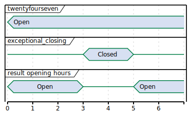
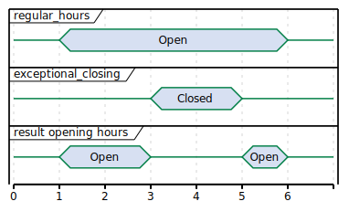

# Locations

:::tip Module Identifier
locations
:::

:::caution Data owner
CPO
:::

:::info Type
Functional Module
:::

The Location objects live in the CPO back-end system. They describe the charging locations of an operator.

**Module dependency:** the Receiver endpoint is dependent on the [Tariffs
module](https://ocpi.dev)

## Flow and Lifecycle

The Locations module has the [Location](https://ocpi.dev) as base object. Each Location can have multiple
EVSEs (1:n) and each EVSE can have multiple Connectors (1:n). With the methods in the [Receiver
interface](https://ocpi.dev), Location data and status information can be shared with for example an eMSP
and NSP. Updates can be made to a whole Location, but also only to an EVSE or a single Connector.

When a CPO creates Location objects, it pushes them to connected eMSP by calling [PUT](https://ocpi.dev) on the
Receivers Locations endpoint. eMSPs who do not support Push mode need to call [GET](https://ocpi.dev) on the
CPOs Locations endpoint to receive the new object. This should be done regularly to stay up to date with the CPOs data,
but not too often in order to keep the load low.

If the CPO wants to replace a Location related object, they again push it to the eMSP systems by calling
[PUT](https://ocpi.dev) on their Locations endpoint.

Any changes to a Location related object can also be pushed to connected eMSPs by calling the
[PATCH](https://ocpi.dev) method on the eMSPs Locations endpoint, but using PATCH mode, only actual changes
should be pushed. Providers who do not support Push mode need to call [GET](https://ocpi.dev) on the CPOs
Locations endpoint to receive the updates.

When the CPO wants to delete an EVSE from the list of active EVSEs, they MUST update the EVSE's `status` field to
`REMOVED` and call the [PUT](https://ocpi.dev) or [PATCH](https://ocpi.dev) on the eMSP system. A
Location without any valid EVSE object can be considered expired and should no longer be displayed. There is no way to
entirely delete Locations, EVSEs and Connectors as there are other modules like
[`sessions`](https://ocpi.dev) that depend on them. If it was possible to remove
these objects, those links would no longer work.

When the CPO is not sure about the state or existence of a Location, EVSE or Connector object in the eMSP's system, the
CPO can perform a [GET](https://ocpi.dev) request to validate the object in the eMSP's system.

Private charging Locations, that are not to be used for public charging, SHALL NOT be published via OCPI.

### No public charging or roaming

When a Location is not available for either Public Charging or Roaming, it is RECOMMENDED to NOT send that Location via
OCPI to receiving parties.

### Group of Charge Points

OCPP 2.0 supports a 3-tier model:

* Highest level is a Charge Point
* A Charge Point can have one or more EVSEs.
* Every EVSE can have one or more Connectors.

OCPI does not have this model:

* OCPI has Location at the highest level.
* Each location can have multiple EVSE
* Every EVSE can have one or more Connectors.

When mapping OCPP Charge Points to OCPI, there are 2 options:

* One Location for a group of Charge Points at the same location. (preferred)
* One Location per Charge Point at the same location.

OCPI prefers the first method. An EV driver does not care if a Location consists of one Charge Point with a very large
amount of EVSEs, or a large amount of Charge Points with only one EVSE. The EV driver wants to know how many EVSEs are
available. Grouping Charge Points in the same location into one OCPI Location will show better on a map that shows
Charging Locations.

:::note

By definition, an EVSE can only charge one EV at a time.

:::

### OCPP 1.x Charge Points with multiple connectors per EVSE

OCPP 1.x was not designed to support the 3-tier model. It had no notion of EVSEs. The Open Charge Alliance has written
an Application Note: "Multiple Connectors per EVSE in a OCPP 1.x implementation"

The workaround:

* Define one *virtual* EVSE per Connector.
* When a connector of an hardware EVSE becomes unavailable, set all *virtual* EVSEs for all the connectors of the
  hardware EVSE to unavailable. etc.

## Interfaces and endpoints

There are both, a Sender and a Receiver interface for Locations. It is advised to use the Push direction from Sender to
Receiver during normal operation in order to keep the latency of updates low. The Sender interface is meant to be used
when the connection between two parties is established for the first time, to retrieve the current list of Location
objects with the current status, and when the Receiver is not 100% sure the Location cache is entirely up-to-date (i.e.
to perform a full sync). The Receiver can also use the Sender [GET Object
interface](https://ocpi.dev) to retrieve a specific Location, EVSE or Connector. This
feature might be used by an Receiver that wants information about a specific Location, but has not implemented the
Receiver Locations interface (i.e. cannot receive Push).

### Sender Interface

Typically implemented by market roles like: CPO.

| Method                  | Description |
|-------------------------|-------------|
| [GET](https://ocpi.dev) |             |
| POST                    | n/a         |
| PUT                     | n/a         |
| PATCH                   | n/a         |
| DELETE                  | n/a         |

#### **GET** Method

Depending on the URL Segments provided, the GET request can either be used to retrieve information about a list of
available Locations (with EVSEs and Connectors) at a CPO ([GET List](https://ocpi.dev)) or it
can be used to retrieve information about one specific Location, EVSE or Connector ([GET
Object](https://ocpi.dev)).

##### GET List: Request Parameters

Endpoint structure definition:

`{locations_endpoint_url}?[date_from={date_from}]&amp;[date_to={date_to}]&amp;[offset={offset}]&amp;[limit={limit}]`

Examples:

* `https://www.server.com/ocpi/cpo/2.2.1/locations/?date_from=2019-01-28T12:00:00&date_to=2019-01-29T12:00:00`
* `https://ocpi.server.com/2.2.1/locations/?offset=50`
* `https://www.server.com/ocpi/2.2.1/locations/?date_from=2019-01-29T12:00:00&limit=100`
* `https://www.server.com/ocpi/cpo/2.2.1/locations/?offset=50&limit=100`

If the optional parameters `{date_from}` and/or `{date_to}` are provided, only Locations with (`last_updated`) between
the given `{date_from}` (including) and `{date_to}` (excluding) will be returned. In order for this to work properly,
the following logic MUST be implemented accordingly: If an EVSE is updated, also the *parent* Location's `last_updated`
field needs to be updated. Similarly, if a Connector is updated, the EVSE's `last_updated` and the Location's
`last_updated` fields need to be updated.

This request is [paginated](https://ocpi.dev), it supports the
[pagination](https://ocpi.dev) related URL parameters.

| Parameter | Datatype                               | Required | Description                                                                                         |
|-----------|----------------------------------------|----------|-----------------------------------------------------------------------------------------------------|
| date_from | [DateTime](/16-types.md#datetime-type) | no       | Only return Locations that have `last_updated` after or equal to this Date/Time (inclusive).        |
| date_to   | [DateTime](/16-types.md#datetime-type) | no       | Only return Locations that have `last_updated` up to this Date/Time, but not including (exclusive). |
| offset    | int                                    | no       | The offset of the first object returned. Default is 0.                                              |
| limit     | int                                    | no       | Maximum number of objects to GET.                                                                   |

##### GET List: Response Data

This endpoint returns a list of Location objects. The header will contain the
[pagination](https://ocpi.dev) related headers.

Each object must contain all required fields. Fields that are not specified may be considered as null values. Any old
information that is not specified in the response is considered no longer valid. For requests that use pagination, the
response data provided by all the pages together is the new truth. Any old information not contained in any of the pages
needs to be considered no longer valid.

| Type                         | Card. | Description                             |
|------------------------------|-------|-----------------------------------------|
| [Location](https://ocpi.dev) | \*    | List of all Locations with valid EVSEs. |

##### GET Object: Request Parameters

Endpoint structure definition for retrieving a Location, EVSE or Connector:

`{locations_endpoint_url}/{location_id}[/{evse_uid}][/{connector_id}]`

Examples:

* `https://www.server.com/ocpi/cpo/2.2.1/locations/LOC1`
* `https://www.server.com/ocpi/cpo/2.2.1/locations/LOC1/3256`
* `https://www.server.com/ocpi/cpo/2.2.1/locations/LOC1/3256/1`

The following parameters can be provided as URL segments in the same order.

| Parameter    | Datatype                                   | Required | Description                                                     |
|--------------|--------------------------------------------|----------|-----------------------------------------------------------------|
| location_id  | [CiString](/16-types.md#cistring-type)(36) | yes      | Location.id of the Location object to retrieve.                 |
| evse_uid     | [CiString](/16-types.md#cistring-type)(36) | no       | Evse.uid, required when requesting an EVSE or Connector object. |
| connector_id | [CiString](/16-types.md#cistring-type)(36) | no       | Connector.id, required when requesting a Connector object.      |

##### GET Object: Response Data

The response contains the requested object.

Choice: one of three

| Type                          | Card. | Description                                                |
|-------------------------------|-------|------------------------------------------------------------|
| [Location](https://ocpi.dev)  | 1     | If a Location object was requested: the Location object.   |
| [EVSE](https://ocpi.dev)      | 1     | If an EVSE object was requested: the EVSE object.          |
| [Connector](https://ocpi.dev) | 1     | If a Connector object was requested: the Connector object. |

### Receiver Interface

Typically implemented by market roles like: eMSP and NSP.

Locations are [Client Owned Objects](https://ocpi.dev), so
the end-points need to contain the required extra fields:
{[party_id](https://ocpi.dev)} and
{[country_code](https://ocpi.dev)}.

Endpoint structure definition:

`{locations_endpoint_url}/{country_code}/{party_id}/{location_id}[/{evse_uid}][/{connector_id}]`

Examples:

* `https://www.server.com/ocpi/emsp/2.2.1/locations/BE/BEC/LOC1`
* `https://server.com/ocpi/2.2.1/locations/BE/BEC/LOC1/3256`
* `https://ocpi.server.com/2.2.1/locations/BE/BEC/LOC1/3256/1`

| Method                    | Description                                                                                                                      |
|---------------------------|----------------------------------------------------------------------------------------------------------------------------------|
| [GET](https://ocpi.dev)   | Retrieve a Location as it is stored in the eMSP system.                                                                          |
| POST                      | n/a *(use [PUT](https://ocpi.dev))*                                                                                              |
| [PUT](https://ocpi.dev)   | Push new/updated Location, EVSE and/or Connector to the eMSP.                                                                    |
| [PATCH](https://ocpi.dev) | Notify the eMSP of partial updates to a Location, EVSE or Connector (such as the status).                                        |
| DELETE                    | n/a *(use [PATCH](https://ocpi.dev) to update the `status` to `REMOVED` as described in [Flow and Lifecycle](https://ocpi.dev))* |

#### **GET** Method

If the CPO wants to check the status of a Location, EVSE or Connector object in the eMSP system, it might GET the object
from the eMSP system for validation purposes. The CPO is the owner of the objects, so it would be illogical if the eMSP
system had a different status or was missing an object. If a discrepancy is found, the CPO might push an update to the
eMSP via a [PUT](https://ocpi.dev) or [PATCH](https://ocpi.dev) call.

##### Request Parameters

The following parameters can be provided as URL segments.

| Parameter    | Datatype                                   | Required | Description                                                             |
|--------------|--------------------------------------------|----------|-------------------------------------------------------------------------|
| country_code | [CiString](/16-types.md#cistring-type)(2)  | yes      | Country code of the CPO requesting data from the eMSP system.           |
| party_id     | [CiString](/16-types.md#cistring-type)(3)  | yes      | Party ID (Provider ID) of the CPO requesting data from the eMSP system. |
| location_id  | [CiString](/16-types.md#cistring-type)(36) | yes      | Location.id of the Location object to retrieve.                         |
| evse_uid     | [CiString](/16-types.md#cistring-type)(36) | no       | Evse.uid, required when requesting an EVSE or Connector object.         |
| connector_id | [CiString](/16-types.md#cistring-type)(36) | no       | Connector.id, required when requesting a Connector object.              |

##### Response Data

The response contains the requested object.

Choice: one of three

| Type                          | Card. | Description                                                |
|-------------------------------|-------|------------------------------------------------------------|
| [Location](https://ocpi.dev)  | 1     | If a Location object was requested: the Location object.   |
| [EVSE](https://ocpi.dev)      | 1     | If an EVSE object was requested: the EVSE object.          |
| [Connector](https://ocpi.dev) | 1     | If a Connector object was requested: the Connector object. |

#### **PUT** Method

The CPO pushes available Location, EVSE or Connector objects to the eMSP. PUT can be used to send new Location objects
to the eMSP but also to replace existing Locations.

When the PUT only contains a [Connector](https://ocpi.dev) Object, the Receiver SHALL also set the new
`last_updated` value on the parent [EVSE](https://ocpi.dev) and [Location](https://ocpi.dev)
Objects.

When the PUT only contains a [EVSE](https://ocpi.dev) Object, the Receiver SHALL also set the new
`last_updated` value on the parent [Location](https://ocpi.dev) Object.

##### Request Parameters

This is an information Push message, the objects pushed will not be owned by the eMSP. To make distinctions between
objects being pushed to an eMSP from different CPOs, the
{[party_id](https://ocpi.dev)} and
{[country_code](https://ocpi.dev)} have to be included in the URL (as URL segments,
as described in the [Receiver Interface](https://ocpi.dev)).

| Parameter    | Datatype                                   | Required | Description                                                                                                                                                   |
|--------------|--------------------------------------------|----------|---------------------------------------------------------------------------------------------------------------------------------------------------------------|
| country_code | [CiString](/16-types.md#cistring-type)(2)  | yes      | Country code of the CPO requesting this PUT to the eMSP system. This SHALL be the same value as the `country_code` in the Location object being pushed.       |
| party_id     | [CiString](/16-types.md#cistring-type)(3)  | yes      | Party ID (Provider ID) of the CPO requesting this PUT to the eMSP system. This SHALL be the same value as the `party_id` in the Location object being pushed. |
| location_id  | [CiString](/16-types.md#cistring-type)(36) | yes      | Location.id of the new Location object, or the Location of which an EVSE or Connector object is pushed.                                                       |
| evse_uid     | [CiString](/16-types.md#cistring-type)(36) | no       | Evse.uid, required when an EVSE or Connector object is pushed.                                                                                                |
| connector_id | [CiString](/16-types.md#cistring-type)(36) | no       | Connector.id, required when a Connector object is pushed.                                                                                                     |

##### Request Body

The request body contains the new/updated object.

When the PUT contains a [Connector](https://ocpi.dev) Object, the Receiver SHALL also set the new
`last_updated` value on the parent [EVSE](https://ocpi.dev) and [Location](https://ocpi.dev)
Objects.

When the PUT contains a [EVSE](https://ocpi.dev) Object, the Receiver SHALL also set the new `last_updated`
value on the parent [Location](https://ocpi.dev) Object.

| Type                          | Card. | Description                                           |
|-------------------------------|-------|-------------------------------------------------------|
| [Location](https://ocpi.dev)  | 1     | New Location object, or Location object to replace.   |
| [EVSE](https://ocpi.dev)      | 1     | New EVSE object, or EVSE object to replace.           |
| [Connector](https://ocpi.dev) | 1     | New Connector object, or Connector object to replace. |

##### Example: add an EVSE

To add an *EVSE*, simply put the full object in an update message, including all its required fields. Since the id will
be new to the eMSP's system, the receiving party will know that it is a new object. When not all required fields are
specified, the object may be discarded.

Example Request:

```shell
curl --request PUT --header "Authorization: Token <OCPI_TOKEN>" "https://www.server.com/ocpi/emsp/2.2.1/locations/NL/TNM/1012/3256"
```

Example Response:

```json
{
  "uid": "3256",
  "evse_id": "BE*BEC*E041503003",
  "status": "AVAILABLE",
  "capabilities": [
    "RESERVABLE"
  ],
  "connectors": [
    {
      "id": "1",
      "standard": "IEC_62196_T2",
      "format": "SOCKET",
      "tariff_ids": [
        "14"
      ]
    }
  ],
  "floor": -1,
  "physical_reference": 3,
  "last_updated": "2019-06-24T12:39:09Z"
}
```

#### **PATCH** Method

Same as the [PUT](https://ocpi.dev) method, but only the fields/objects that have to be updated have to be
present. Other fields/objects that are not specified as part of the request are considered unchanged. Therefore, this
method is not suitable to remove information shared earlier.

Any request to the PATCH method SHALL contain the `last_updated` field.

When the PATCH is on a [Connector](https://ocpi.dev) Object, the Receiver SHALL also set the new
`last_updated` value on the parent [EVSE](https://ocpi.dev) and [Location](https://ocpi.dev)
Objects.

When the PATCH is on a [EVSE](https://ocpi.dev) Object, the Receiver SHALL also set the new `last_updated`
value on the parent [Location](https://ocpi.dev) Object.

##### Example: a simple status update

This is the most common type of update message. It is used to notify eMSPs that the status of an EVSE changed. In this
case it is the EVSE with uid `3255` of the Location with id `1012`.

Example Request:

```shell
curl --request PATCH --header "Authorization: Token <OCPI_TOKEN>" "https://www.server.com/ocpi/emsp/2.2.1/locations/NL/TNM/1012/3255"
```

Example Response:

```json
{
  "status": "CHARGING",
  "last_updated": "2019-06-24T12:39:09Z"
}
```

##### Example: change the location name

In this example the name of the Location with id `1012` is being updated.

Example Request:

```shell
curl --request PATCH --header "Authorization: Token <OCPI_TOKEN>" "https://www.server.com/ocpi/emsp/2.2.1/locations/NL/TNM/1012"
```

Example Response:

```json
{
  "name": "Interparking Gent Zuid",
  "last_updated": "2019-06-24T12:39:09Z"
}
```

##### Example: set tariff update

In this example Connector `2` of EVSE `1` of Location `1012` receives a new pricing scheme.

Example Request:

```shell
curl --request PATCH --header "Authorization: Token <OCPI_TOKEN>" "https://www.server.com/ocpi/emsp/2.2.1/locations/NL/TNM/1012/3255/2"
```

Example Response:

```json
{
  "tariff_ids": [
    "15"
  ],
  "last_updated": "2019-06-24T12:39:09Z"
}
```

##### Example: delete an EVSE

An EVSE can be deleted by updating its `status` property.

Example Request:

```shell
curl --request PATCH --header "Authorization: Token <OCPI_TOKEN>" "https://www.server.com/ocpi/emsp/2.2.1/locations/NL/TNM/1012/3256"
```

Example Response:

```json
{
  "status": "REMOVED",
  "last_updated": "2019-06-24T12:39:09Z"
}
```

:::note

To inform eMSPs that an EVSE is scheduled for removal, the status_schedule field can be used.\_

:::

## Object description

Location, EVSE and Connector have the following relation.


### *Location* Object

The *Location* object describes the location and its properties where a group of EVSEs that belong together are
installed. Typically, the *Location* object is the exact location of the group of EVSEs, but it can also be the entrance
of a parking garage which contains these EVSEs. The exact way to reach each EVSE can be further specified by its own
properties.

Locations may be shown in apps or on websites etc. when the flag: `publish` is set to `true`. Locations that have this
flag set to `false` SHALL not be shown in an app or on a website etc. unless it is to the owner of a
[Token](https://ocpi.dev) in the `publish_allowed_to` list. Even parties like NSP or eMSP
that do not *own* this Token MAY show this location on an app or website, but only to the owner of that Token. If the
user of their app/website has provided information about his/her [Token](https://ocpi.dev),
And that information matches all the fields of one of the [PublishToken](https://ocpi.dev) tokens in
the list, then they are allowed to show this location to their user. It is not allowed in OCPI to use a Token that is
not *owned* by the eMSP itself to start a charging session.

| Property             | Type                                          | Card. | Description                                                                                                                                                                                                                                                                                                        |
|----------------------|-----------------------------------------------|-------|--------------------------------------------------------------------------------------------------------------------------------------------------------------------------------------------------------------------------------------------------------------------------------------------------------------------|
| country_code         | [CiString](/16-types.md#cistring-type)(2)     | 1     | ISO-3166 alpha-2 country code of the CPO that *owns* this Location.                                                                                                                                                                                                                                                |
| party_id             | [CiString](/16-types.md#cistring-type)(3)     | 1     | ID of the CPO that *owns* this Location (following the ISO-15118 standard).                                                                                                                                                                                                                                        |
| id                   | [CiString](/16-types.md#cistring-type)(36)    | 1     | Uniquely identifies the location within the CPOs platform (and suboperator platforms). This field can never be changed, modified or renamed.                                                                                                                                                                       |
| publish              | boolean                                       | 1     | Defines if a Location may be published on an website or app etc. When this is set to `false`, only tokens identified in the field: `publish_allowed_to` are allowed to be shown this Location. When the same location has EVSEs that may be published and may not be published, two *Locations* should be created. |
| publish_allowed_to   | [PublishTokenType](https://ocpi.dev)          | \*    | This field may only be used when the `publish` field is set to `false`. Only owners of Tokens that match all the set fields of one PublishToken in the list are allowed to be shown this location.                                                                                                                 |
| name                 | [string](/16-types.md#string-type)(255)       | ?     | Display name of the location.                                                                                                                                                                                                                                                                                      |
| address              | [string](/16-types.md#string-type)(45)        | 1     | Street/block name and house number if available.                                                                                                                                                                                                                                                                   |
| city                 | [string](/16-types.md#string-type)(45)        | 1     | City or town.                                                                                                                                                                                                                                                                                                      |
| postal_code          | [string](/16-types.md#string-type)(10)        | ?     | Postal code of the location, may only be omitted when the location has no postal code: in some countries charging locations at highways don't have postal codes.                                                                                                                                                   |
| state                | [string](/16-types.md#string-type)(20)        | ?     | State or province of the location, only to be used when relevant.                                                                                                                                                                                                                                                  |
| country              | [string](/16-types.md#string-type)(3)         | 1     | ISO 3166-1 alpha-3 code for the country of this location.                                                                                                                                                                                                                                                          |
| coordinates          | [GeoLocation](https://ocpi.dev)               | 1     | Coordinates of the location.                                                                                                                                                                                                                                                                                       |
| related_locations    | [AdditionalGeoLocation](https://ocpi.dev)     | \*    | Geographical location of related points relevant to the user.                                                                                                                                                                                                                                                      |
| parking_type         | [ParkingType](https://ocpi.dev)               | ?     | The general type of parking at the charge point location.                                                                                                                                                                                                                                                          |
| evses                | [EVSE](https://ocpi.dev)                      | \*    | List of EVSEs that belong to this Location.                                                                                                                                                                                                                                                                        |
| directions           | [DisplayText](/16-types.md#displaytext-class) | \*    | Human-readable directions on how to reach the location.                                                                                                                                                                                                                                                            |
| operator             | [BusinessDetails](https://ocpi.dev)           | ?     | Information of the operator. When not specified, the information retrieved from the [Credentials](https://ocpi.dev) module, selected by the `country_code` and `party_id` of this Location, should be used instead.                                                                                                |
| suboperator          | [BusinessDetails](https://ocpi.dev)           | ?     | Information of the suboperator if available.                                                                                                                                                                                                                                                                       |
| owner                | [BusinessDetails](https://ocpi.dev)           | ?     | Information of the owner if available.                                                                                                                                                                                                                                                                             |
| facilities           | [Facility](https://ocpi.dev)                  | \*    | Optional list of facilities this charging location directly belongs to.                                                                                                                                                                                                                                            |
| time_zone            | [string](/16-types.md#string-type)(255)       | 1     | One of IANA tzdata's TZ-values representing the time zone of the location. Examples: "Europe/Oslo", "Europe/Zurich". (<http://www.iana.org/time-zones>)                                                                                                                                                            |
| opening_times        | [Hours](https://ocpi.dev)                     | ?     | The times when the EVSEs at the location can be accessed for charging.                                                                                                                                                                                                                                             |
| charging_when_closed | boolean                                       | ?     | Indicates if the EVSEs are still charging outside the opening hours of the location. E.g. when the parking garage closes its barriers over night, is it allowed to charge till the next morning? Default: **true**                                                                                                 |
| images               | [Image](https://ocpi.dev)                     | \*    | Links to images related to the location such as photos or logos.                                                                                                                                                                                                                                                   |
| energy_mix           | [EnergyMix](https://ocpi.dev)                 | ?     | Details on the energy supplied at this location.                                                                                                                                                                                                                                                                   |
| last_updated         | [DateTime](/16-types.md#datetime-type)        | 1     | Timestamp when this Location or one of its EVSEs or Connectors were last updated (or created).                                                                                                                                                                                                                     |

Private Charge Points, home or business that do not need to be published on apps, and do not require remote control via
OCPI, SHOULD not be PUT via the OCPI Locations module.

#### Example public charging location

This is an example of a public charging location. Can be used by any EV Driver as long as his eMSP has a roaming
agreement with the CPO. Or the Charge Point has an ad-hoc payment possibility

* `publish` = `true`
* `parking_type` = `ON_STREET` but could also be another value.
* `EVSE.parking_restrictions` not used.

``` json
{
  "country_code": "BE",
  "party_id": "BEC",
  "id": "LOC1",
  "publish": true,
  "name": "Gent Zuid",
  "address": "F.Rooseveltlaan 3A",
  "city": "Gent",
  "postal_code": "9000",
  "country": "BEL",
  "coordinates": {
    "latitude": "51.047599",
    "longitude": "3.729944"
  },
  "parking_type": "ON_STREET",
  "evses": [
    {
      "uid": "3256",
      "evse_id": "BE*BEC*E041503001",
      "status": "AVAILABLE",
      "capabilities": [
        "RESERVABLE"
      ],
      "connectors": [
        {
          "id": "1",
          "standard": "IEC_62196_T2",
          "format": "CABLE",
          "power_type": "AC_3_PHASE",
          "max_voltage": 220,
          "max_amperage": 16,
          "tariff_ids": [
            "11"
          ],
          "last_updated": "2015-03-16T10:10:02Z"
        },
        {
          "id": "2",
          "standard": "IEC_62196_T2",
          "format": "SOCKET",
          "power_type": "AC_3_PHASE",
          "max_voltage": 220,
          "max_amperage": 16,
          "tariff_ids": [
            "13"
          ],
          "last_updated": "2015-03-18T08:12:01Z"
        }
      ],
      "physical_reference": "1",
      "floor_level": "-1",
      "last_updated": "2015-06-28T08:12:01Z"
    },
    {
      "uid": "3257",
      "evse_id": "BE*BEC*E041503002",
      "status": "RESERVED",
      "capabilities": [
        "RESERVABLE"
      ],
      "connectors": [
        {
          "id": "1",
          "standard": "IEC_62196_T2",
          "format": "SOCKET",
          "power_type": "AC_3_PHASE",
          "max_voltage": 220,
          "max_amperage": 16,
          "tariff_ids": [
            "12"
          ],
          "last_updated": "2015-06-29T20:39:09Z"
        }
      ],
      "physical_reference": "2",
      "floor_level": "-2",
      "last_updated": "2015-06-29T20:39:09Z"
    }
  ],
  "operator": {
    "name": "BeCharged"
  },
  "time_zone": "Europe/Brussels",
  "last_updated": "2015-06-29T20:39:09Z"
}
```

#### Example destination charging location

This is an example of a destination charging location. This is a Location where only guests, employees or customers can
charge. For an EV driver, it can be useful to know if he/she can charge at his destination.

For example at a restaurant, only customers of the restaurant can charge their EV. Or at an office building where
employees and guest of the office can charge their EV.

Locations you can think of where this is useful: restaurants, bars, clubs, theme parks, stores, supermarkets, company
building, office buildings, etc.

* `publish` = `true`
* `parking_type` = `PARKING_LOT` (but could also be `PARKING_GARAGE`, `ON_DRIVEWAY` or `UNDERGROUND_GARAGE`)
* `EVSE.parking_restrictions` = `CUSTOMERS`

``` json
{
  "country_code": "NL",
  "party_id": "ALF",
  "id": "3e7b39c2-10d0-4138-a8b3-8509a25f9920",
  "publish": true,
  "name": "ihomer",
  "address": "Tamboerijn 7",
  "city": "Etten-Leur",
  "postal_code": "4876 BS",
  "country": "NLD",
  "coordinates": {
    "latitude": "51.562787",
    "longitude": "4.638975"
  },
  "parking_type": "PARKING_LOT",
  "evses": [
    {
      "uid": "fd855359-bc81-47bb-bb89-849ae3dac89e",
      "evse_id": "NL*ALF*E000000001",
      "status": "AVAILABLE",
      "connectors": [
        {
          "id": "1",
          "standard": "IEC_62196_T2",
          "format": "SOCKET",
          "power_type": "AC_3_PHASE",
          "max_voltage": 220,
          "max_amperage": 16,
          "last_updated": "2019-07-01T12:12:11Z"
        }
      ],
      "parking_restrictions": [
        "CUSTOMERS"
      ],
      "last_updated": "2019-07-01T12:12:11Z"
    }
  ],
  "time_zone": "Europe/Amsterdam",
  "last_updated": "2019-07-01T12:12:11Z"
}
```

#### Example destination charging location not published, but paid guest usage possible

This is an example of a destination charging location. But the owner of the location has requested not to publish the
location in Apps or on websites.

Charging is still possible: EV drivers of an eMSP with a roaming agreement can still charge their EV. The eMSP helpdesk
can use the information from the Location module to help the driver, maybe even start a session for a driver. Starting a
session from an App is not possible, because the driver will not be able to select the Charge Point on a map.

In case the EV driver is not billed for charging, there is, in such a case, no reason to publish the location via OCPI.

* `publish` = `false`
* `publish_allowed_to` not used
* `parking_type` = not used\`
* `EVSE.parking_restrictions` = `CUSTOMERS` May still be useful so a support desk can also tell this to a customer.

``` json
{
  "country_code": "NL",
  "party_id": "ALF",
  "id": "3e7b39c2-10d0-4138-a8b3-8509a25f9920",
  "publish": false,
  "name": "ihomer",
  "address": "Tamboerijn 7",
  "city": "Etten-Leur",
  "postal_code": "4876 BS",
  "country": "NLD",
  "coordinates": {
    "latitude": "51.562787",
    "longitude": "4.638975"
  },
  "evses": [
    {
      "uid": "fd855359-bc81-47bb-bb89-849ae3dac89e",
      "evse_id": "NL*ALF*E000000001",
      "status": "AVAILABLE",
      "connectors": [
        {
          "id": "1",
          "standard": "IEC_62196_T2",
          "format": "SOCKET",
          "power_type": "AC_3_PHASE",
          "max_voltage": 220,
          "max_amperage": 16,
          "last_updated": "2019-07-01T12:12:11Z"
        }
      ],
      "parking_restrictions": [
        "CUSTOMERS"
      ],
      "last_updated": "2019-07-01T12:12:11Z"
    }
  ],
  "time_zone": "Europe/Amsterdam",
  "last_updated": "2019-07-01T12:12:11Z"
}
```

#### Example charging location with limited visibility

This is an example of a charging location that only a limited group can see (and use) via an App or website.

Typical examples where this is useful:

* Charge Points in the parking garage of an apartment building. Only owners can see/control the Charge Points.
* Charge Points at an office, for employees only. Only employees can see/control the Charge Points.
* Charge Points at vehicle depot. Any employee can see/control an charge point, even transaction they did not start. Use
  `group_id` for this.

The locations SHALL NOT be published to the general public. Only selected
[Tokens](https://ocpi.dev) can see (and control) the Charge Points via eMSP app.

* `publish` = `false`
* `publish_allowed_to` contains list with information of [Tokens](https://ocpi.dev) that are
  allowed to be shown the `Location`.
* `parking_type` = `UNDERGROUND_GARAGE` (but could also be `PARKING_GARAGE`, `ON_DRIVEWAY` or `PARKING_LOT`)

``` json
{
  "country_code": "NL",
  "party_id": "ALL",
  "id": "f76c2e0c-a6ef-4f67-bf23-6a187e5ca0e0",
  "publish": false,
  "publish_allowed_to": [
    {
      "visual_number": "12345-67",
      "issuer": "NewMotion"
    },
    {
      "visual_number": "0055375624",
      "issuer": "ANWB"
    },
    {
      "uid": "12345678905880",
      "type": "RFID"
    }
  ],
  "name": "Water State",
  "address": "Taco van der Veenplein 12",
  "city": "Leeuwarden",
  "postal_code": "8923 EM",
  "country": "NLD",
  "coordinates": {
    "latitude": "53.213763",
    "longitude": "5.804638"
  },
  "parking_type": "UNDERGROUND_GARAGE",
  "evses": [
    {
      "uid": "8c1b3487-61ac-40a7-a367-21eee99dbd90",
      "evse_id": "NL*ALL*EGO0000013",
      "status": "AVAILABLE",
      "connectors": [
        {
          "id": "1",
          "standard": "IEC_62196_T2",
          "format": "SOCKET",
          "power_type": "AC_3_PHASE",
          "max_voltage": 230,
          "max_amperage": 16,
          "last_updated": "2019-09-27T00:19:45Z"
        }
      ],
      "last_updated": "2019-09-27T00:19:45Z"
    }
  ],
  "time_zone": "Europe/Amsterdam",
  "last_updated": "2019-09-27T00:19:45Z"
}
```

#### Example private charge point with eMSP app control

This is an example of a private/home charge point that needs to be controlled via an eMSP App.

The locations SHALL NOT be published to the general public. Only the owner, identified by his/her
[Token](https://ocpi.dev) can see (and control) the Charge Points via an eMSP app.

* `publish` = `false`
* `publish_allowed_to` contains the information of the [Tokens](https://ocpi.dev) of the
  owner.
* `parking_type` = not used, not relevant, owner knows where his Charge Point is.

``` json
{
  "country_code": "DE",
  "party_id": "ALL",
  "id": "a5295927-09b9-4a71-b4b9-a5fffdfa0b77",
  "publish": false,
  "publish_allowed_to": [
    {
      "visual_number": "0123456-99",
      "issuer": "MoveMove"
    }
  ],
  "address": "Krautwigstraße 283A",
  "city": "Köln",
  "postal_code": "50931",
  "country": "DEU",
  "coordinates": {
    "latitude": "50.931826",
    "longitude": "6.964043"
  },
  "parking_type": "ON_DRIVEWAY",
  "evses": [
    {
      "uid": "4534ad5f-45be-428b-bfd0-fa489dda932d",
      "evse_id": "DE*ALL*EGO0000001",
      "status": "AVAILABLE",
      "connectors": [
        {
          "id": "1",
          "standard": "IEC_62196_T2",
          "format": "SOCKET",
          "power_type": "AC_1_PHASE",
          "max_voltage": 230,
          "max_amperage": 8,
          "last_updated": "2019-04-05T17:17:56Z"
        }
      ],
      "last_updated": "2019-04-05T17:17:56Z"
    }
  ],
  "time_zone": "Europe/Berlin",
  "last_updated": "2019-04-05T17:17:56Z"
}
```

#### Example charge point in a parking garage with opening hours

This is an example of a charge point, located in a parking garage with limited opening hours: 7:00 * 18:00.

If the EV is left in the parking garage overnight, the car will still be charged.

* `publish` = `true`
* `parking_type` = `PARKING_GARAGE` but could also be another value.
* `EVSE.parking_restrictions` not used.
* `opening_times` is used.
* `charging_when_closed` = `true`

``` json
{
  "country_code": "SE",
  "party_id": "EVC",
  "id": "cbb0df21-d17d-40ba-a4aa-dc588c8f98cb",
  "publish": true,
  "name": "P-Huset Leonard",
  "address": "Claesgatan 6",
  "city": "Malmö",
  "postal_code": "214 26",
  "country": "SWE",
  "coordinates": {
    "latitude": "55.590325",
    "longitude": "13.008307"
  },
  "parking_type": "PARKING_GARAGE",
  "evses": [
    {
      "uid": "eccb8dd9-4189-433e-b100-cc0945dd17dc",
      "evse_id": "SE*EVC*E000000123",
      "status": "AVAILABLE",
      "connectors": [
        {
          "id": "1",
          "standard": "IEC_62196_T2",
          "format": "SOCKET",
          "power_type": "AC_3_PHASE",
          "max_voltage": 230,
          "max_amperage": 32,
          "last_updated": "2017-03-07T02:21:22Z"
        }
      ],
      "last_updated": "2017-03-07T02:21:22Z"
    }
  ],
  "time_zone": "Europe/Stockholm",
  "opening_times": {
    "twentyfourseven": false,
    "regular_hours": [
      {
        "weekday": 1,
        "period_begin": "07:00",
        "period_end": "18:00"
      },
      {
        "weekday": 2,
        "period_begin": "07:00",
        "period_end": "18:00"
      },
      {
        "weekday": 3,
        "period_begin": "07:00",
        "period_end": "18:00"
      },
      {
        "weekday": 4,
        "period_begin": "07:00",
        "period_end": "18:00"
      },
      {
        "weekday": 5,
        "period_begin": "07:00",
        "period_end": "18:00"
      },
      {
        "weekday": 6,
        "period_begin": "07:00",
        "period_end": "18:00"
      },
      {
        "weekday": 7,
        "period_begin": "07:00",
        "period_end": "18:00"
      }
    ]
  },
  "charging_when_closed": true,
  "last_updated": "2017-03-07T02:21:22Z"
}
```

### *EVSE* Object

The *EVSE* object describes the part that controls the power supply to a single EV in a single session. It always
belongs to a [Location](https://ocpi.dev) object. The object only contains directions to get from the
location itself to the EVSE (i.e. *floor*, *physical_reference* or *directions*).

When the directional properties of an EVSE are insufficient to reach the EVSE from the *Location* point, then it
typically indicates that the EVSE should be put in a different *Location* object (sometimes with the same address but
with different coordinates/directions).

An *EVSE* object has a list of Connectors which can not be used simultaneously: only one connector per EVSE can be used
at the time.

| Property             | Type                                          | Card. | Description                                                                                                                                                                                                                                                                                                                                                                                                                                                                                                                                                                                                                                                                                                                                                                                                                                                                         |
|----------------------|-----------------------------------------------|-------|-------------------------------------------------------------------------------------------------------------------------------------------------------------------------------------------------------------------------------------------------------------------------------------------------------------------------------------------------------------------------------------------------------------------------------------------------------------------------------------------------------------------------------------------------------------------------------------------------------------------------------------------------------------------------------------------------------------------------------------------------------------------------------------------------------------------------------------------------------------------------------------|
| uid                  | [CiString](/16-types.md#cistring-type)(36)    | 1     | Uniquely identifies the EVSE within the CPOs platform (and suboperator platforms). This field can never be changed, modified or renamed. This is the *technical* identification of the EVSE, not to be used as *human readable* identification, use the field `evse_id` for that. This field is named `uid` instead of `id`, because `id` could be confused with `evse_id` which is an eMI3 defined field. Note that in order to fulfill both the requirement that an EVSE's `uid` be unique within a CPO's platform and the [requirement that EVSEs are never deleted](https://ocpi.dev), a CPO will typically want to avoid using identifiers of the physical hardware for this `uid` property. If they do use such a physical identifier, they will find themselves breaking the uniqueness requirement for `uid` when the same physical EVSE is redeployed at another Location. |
| evse_id              | [CiString](/16-types.md#cistring-type)(48)    | ?     | Compliant with the following specification for EVSE ID from "eMI3 standard version V1.0" (<http://emi3group.com/documents-links/>) "Part 2: business objects." Optional because: if an `evse_id` is to be re-used in the real world, the `evse_id` can be removed from an EVSE object if the `status` is set to `REMOVED`.                                                                                                                                                                                                                                                                                                                                                                                                                                                                                                                                                          |
| status               | [Status](https://ocpi.dev)                    | 1     | Indicates the current status of the EVSE.                                                                                                                                                                                                                                                                                                                                                                                                                                                                                                                                                                                                                                                                                                                                                                                                                                           |
| status_schedule      | [StatusSchedule](https://ocpi.dev)            | \*    | Indicates a planned status update of the EVSE.                                                                                                                                                                                                                                                                                                                                                                                                                                                                                                                                                                                                                                                                                                                                                                                                                                      |
| capabilities         | [Capability](https://ocpi.dev)                | \*    | List of functionalities that the EVSE is capable of.                                                                                                                                                                                                                                                                                                                                                                                                                                                                                                                                                                                                                                                                                                                                                                                                                                |
| connectors           | [Connector](https://ocpi.dev)                 | \+    | List of available connectors on the EVSE.                                                                                                                                                                                                                                                                                                                                                                                                                                                                                                                                                                                                                                                                                                                                                                                                                                           |
| floor_level          | [string](/16-types.md#string-type)(4)         | ?     | Level on which the Charge Point is located (in garage buildings) in the locally displayed numbering scheme.                                                                                                                                                                                                                                                                                                                                                                                                                                                                                                                                                                                                                                                                                                                                                                         |
| coordinates          | [GeoLocation](https://ocpi.dev)               | ?     | Coordinates of the EVSE.                                                                                                                                                                                                                                                                                                                                                                                                                                                                                                                                                                                                                                                                                                                                                                                                                                                            |
| physical_reference   | [string](/16-types.md#string-type)(16)        | ?     | A number/string printed on the outside of the EVSE for visual identification.                                                                                                                                                                                                                                                                                                                                                                                                                                                                                                                                                                                                                                                                                                                                                                                                       |
| directions           | [DisplayText](/16-types.md#displaytext-class) | \*    | Multi-language human-readable directions when more detailed information on how to reach the EVSE from the *Location* is required.                                                                                                                                                                                                                                                                                                                                                                                                                                                                                                                                                                                                                                                                                                                                                   |
| parking_restrictions | [ParkingRestriction](https://ocpi.dev)        | \*    | The restrictions that apply to the parking spot.                                                                                                                                                                                                                                                                                                                                                                                                                                                                                                                                                                                                                                                                                                                                                                                                                                    |
| images               | [Image](https://ocpi.dev)                     | \*    | Links to images related to the EVSE such as photos or logos.                                                                                                                                                                                                                                                                                                                                                                                                                                                                                                                                                                                                                                                                                                                                                                                                                        |
| last_updated         | [DateTime](/16-types.md#datetime-type)        | 1     | Timestamp when this EVSE or one of its Connectors was last updated (or created).                                                                                                                                                                                                                                                                                                                                                                                                                                                                                                                                                                                                                                                                                                                                                                                                    |

:::note

OCPP 1.x does not have good support for Charge Points that have multiple connectors per EVSE. To make `StartSession`
over OCPI work, the CPO SHOULD present the different connectors of an EVSE as separate EVSE, as is also written by the
OCA in the application note: "Multiple Connectors per EVSE in a OCPP 1.x implementation".

:::

### *Connector* Object

A *Connector* is the *socket* or *cable and plug* available for the EV to use. A single EVSE may provide multiple
Connectors but only one of them can be in use at the same time. A Connector always belongs to an
[EVSE](https://ocpi.dev) object.

| Property             | Type                                       | Card. | Description                                                                                                                                                                                                                                                                                                                                                                                                                                                                                                                                                                                                                                                                                                              |
|----------------------|--------------------------------------------|-------|--------------------------------------------------------------------------------------------------------------------------------------------------------------------------------------------------------------------------------------------------------------------------------------------------------------------------------------------------------------------------------------------------------------------------------------------------------------------------------------------------------------------------------------------------------------------------------------------------------------------------------------------------------------------------------------------------------------------------|
| id                   | [CiString](/16-types.md#cistring-type)(36) | 1     | Identifier of the Connector within the EVSE. Two Connectors may have the same id as long as they do not belong to the same *EVSE* object.                                                                                                                                                                                                                                                                                                                                                                                                                                                                                                                                                                                |
| standard             | [ConnectorType](https://ocpi.dev)          | 1     | The standard of the installed connector.                                                                                                                                                                                                                                                                                                                                                                                                                                                                                                                                                                                                                                                                                 |
| format               | [ConnectorFormat](https://ocpi.dev)        | 1     | The format (socket/cable) of the installed connector.                                                                                                                                                                                                                                                                                                                                                                                                                                                                                                                                                                                                                                                                    |
| power_type           | [PowerType](https://ocpi.dev)              | 1     |                                                                                                                                                                                                                                                                                                                                                                                                                                                                                                                                                                                                                                                                                                                          |
| max_voltage          | int                                        | 1     | Maximum voltage of the connector (line to neutral for AC_3_PHASE), in volt \[V\]. For example: DC Chargers might vary the voltage during charging when battery almost full.                                                                                                                                                                                                                                                                                                                                                                                                                                                                                                                                              |
| max_amperage         | int                                        | 1     | Maximum amperage of the connector, in ampere \[A\].                                                                                                                                                                                                                                                                                                                                                                                                                                                                                                                                                                                                                                                                      |
| max_electric_power   | int                                        | ?     | Maximum electric power that can be delivered by this connector, in Watts (W). When the maximum electric power is lower than the calculated value from `voltage` and `amperage`, this value should be set. For example: A DC Charge Point which can delivers up to 920V and up to 400A can be limited to a maximum of 150kW (max_electric_power = 150000). Depending on the car, it may supply max voltage or current, but not both at the same time. For AC Charge Points, the amount of phases used can also have influence on the maximum power.                                                                                                                                                                       |
| tariff_ids           | [CiString](/16-types.md#cistring-type)(36) | \*    | Identifiers of the currently valid charging tariffs. Multiple tariffs are possible, but only one of each [Tariff.type](https://ocpi.dev) can be active at the same time. Tariffs with the same type are only allowed if they are not active at the same time: [start_date_time](https://ocpi.dev) and [end_date_time](https://ocpi.dev) period not overlapping. When preference-based smart charging is supported, one tariff for every possible [ProfileType](https://ocpi.dev) should be provided. These tell the user about the options they have at this Connector, and what the tariff is for every option. For a "free of charge" tariff, this field should be set and point to a defined "free of charge" tariff. |
| terms_and_conditions | [URL](/16-types.md#url-type)               | ?     | URL to the operator's terms and conditions.                                                                                                                                                                                                                                                                                                                                                                                                                                                                                                                                                                                                                                                                              |
| last_updated         | [DateTime](/16-types.md#datetime-type)     | 1     | Timestamp when this Connector was last updated (or created).                                                                                                                                                                                                                                                                                                                                                                                                                                                                                                                                                                                                                                                             |

## Data types

### AdditionalGeoLocation *class*

This class defines an additional geo location that is relevant for the Charge Point. The geodetic system to be used is
WGS 84.

| Property  | Type                                          | Card. | Description                                                                                                                              |
|-----------|-----------------------------------------------|-------|------------------------------------------------------------------------------------------------------------------------------------------|
| latitude  | [string](/16-types.md#string-type)(10)        | 1     | Latitude of the point in decimal degree. Example: 50.770774. Decimal separator: "." Regex: `-?[0-9]{1,2}\.[0-9]{5,7}`                    |
| longitude | [string](/16-types.md#string-type)(11)        | 1     | Longitude of the point in decimal degree. Example: -126.104965. Decimal separator: "." Regex: `-?[0-9]{1,3}\.[0-9]{5,7}`                 |
| name      | [DisplayText](/16-types.md#displaytext-class) | ?     | Name of the point in local language or as written at the location. For example the street name of a parking lot entrance or it's number. |

### BusinessDetails *class*

| Property | Type                                    | Card. | Description                        |
|----------|-----------------------------------------|-------|------------------------------------|
| name     | [string](/16-types.md#string-type)(100) | 1     | Name of the operator.              |
| website  | [URL](/16-types.md#url-type)            | ?     | Link to the operator's website.    |
| logo     | [Image](https://ocpi.dev)               | ?     | Image link to the operator's logo. |

### Capability *enum*

The capabilities of an EVSE.

| Value                            | Description                                                                                                                                                                                           |
|----------------------------------|-------------------------------------------------------------------------------------------------------------------------------------------------------------------------------------------------------|
| CHARGING_PROFILE_CAPABLE         | The EVSE supports charging profiles.                                                                                                                                                                  |
| CHARGING_PREFERENCES_CAPABLE     | The EVSE supports [charging preferences](https://ocpi.dev).                                                                                                                                           |
| CHIP_CARD_SUPPORT                | EVSE has a payment terminal that supports chip cards.                                                                                                                                                 |
| CONTACTLESS_CARD_SUPPORT         | EVSE has a payment terminal that supports contactless cards.                                                                                                                                          |
| CREDIT_CARD_PAYABLE              | EVSE has a payment terminal that makes it possible to pay for charging using a credit card.                                                                                                           |
| DEBIT_CARD_PAYABLE               | EVSE has a payment terminal that makes it possible to pay for charging using a debit card.                                                                                                            |
| PED_TERMINAL                     | EVSE has a payment terminal with a pin-code entry device.                                                                                                                                             |
| REMOTE_START_STOP_CAPABLE        | The EVSE can remotely be [started](https://ocpi.dev)/[stopped](https://ocpi.dev).                                                                                                                     |
| RESERVABLE                       | The EVSE can be [reserved](https://ocpi.dev).                                                                                                                                                         |
| RFID_READER                      | Charging at this EVSE can be authorized with an RFID token.                                                                                                                                           |
| START_SESSION_CONNECTOR_REQUIRED | When a [StartSession](https://ocpi.dev) is sent to this EVSE, the MSP is required to add the optional `connector_id` field in the [StartSession](https://ocpi.dev) object.                            |
| TOKEN_GROUP_CAPABLE              | This EVSE supports token groups, two or more tokens work as one, so that a session can be started with one token and stopped with another (handy when a card and key-fob are given to the EV-driver). |
| UNLOCK_CAPABLE                   | Connectors have mechanical lock that can be requested by the eMSP to be [unlocked](https://ocpi.dev).                                                                                                 |

When a Charge Point supports ad-hoc payments with a payment terminal, please use a combination of the following values
to explain the possibilities of the terminal: CHIP_CARD_SUPPORT, CONTACTLESS_CARD_SUPPORT, CREDIT_CARD_PAYABLE,
DEBIT_CARD_PAYABLE, PED_TERMINAL.

There are Charge Points in the field that do not yet support OCPP 2.x. If these Charge Points have multiple connectors
per EVSE, the CPO needs to know which connector to start when receiving a
[StartSession](https://ocpi.dev) for the given EVSE. If this is the case, the CPO
should set the `START_SESSION_CONNECTOR_REQUIRED` capability on the given EVSE.

### ConnectorFormat *enum*

The format of the connector, whether it is a socket or a plug.

| Value  | Description                                                                         |
|--------|-------------------------------------------------------------------------------------|
| SOCKET | The connector is a socket; the EV user needs to bring a fitting plug.               |
| CABLE  | The connector is an attached cable; the EV users car needs to have a fitting inlet. |

### ConnectorType *enum*

The socket or plug standard of the charging point.

| Value                 | Description                                                                                           |
|-----------------------|-------------------------------------------------------------------------------------------------------|
| CHADEMO               | The connector type is CHAdeMO, DC                                                                     |
| CHAOJI                | The ChaoJi connector. The new generation charging connector, harmonized between CHAdeMO and GB/T. DC. |
| DOMESTIC_A            | Standard/Domestic household, type "A", NEMA 1-15, 2 pins                                              |
| DOMESTIC_B            | Standard/Domestic household, type "B", NEMA 5-15, 3 pins                                              |
| DOMESTIC_C            | Standard/Domestic household, type "C", CEE 7/17, 2 pins                                               |
| DOMESTIC_D            | Standard/Domestic household, type "D", 3 pin                                                          |
| DOMESTIC_E            | Standard/Domestic household, type "E", CEE 7/5 3 pins                                                 |
| DOMESTIC_F            | Standard/Domestic household, type "F", CEE 7/4, Schuko, 3 pins                                        |
| DOMESTIC_G            | Standard/Domestic household, type "G", BS 1363, Commonwealth, 3 pins                                  |
| DOMESTIC_H            | Standard/Domestic household, type "H", SI-32, 3 pins                                                  |
| DOMESTIC_I            | Standard/Domestic household, type "I", AS 3112, 3 pins                                                |
| DOMESTIC_J            | Standard/Domestic household, type "J", SEV 1011, 3 pins                                               |
| DOMESTIC_K            | Standard/Domestic household, type "K", DS 60884-2-D1, 3 pins                                          |
| DOMESTIC_L            | Standard/Domestic household, type "L", CEI 23-16-VII, 3 pins                                          |
| DOMESTIC_M            | Standard/Domestic household, type "M", BS 546, 3 pins                                                 |
| DOMESTIC_N            | Standard/Domestic household, type "N", NBR 14136, 3 pins                                              |
| DOMESTIC_O            | Standard/Domestic household, type "O", TIS 166-2549, 3 pins                                           |
| GBT_AC                | Guobiao GB/T 20234.2 AC socket/connector                                                              |
| GBT_DC                | Guobiao GB/T 20234.3 DC connector                                                                     |
| IEC_60309_2_single_16 | IEC 60309-2 Industrial Connector single phase 16 amperes (usually blue)                               |
| IEC_60309_2_three_16  | IEC 60309-2 Industrial Connector three phases 16 amperes (usually red)                                |
| IEC_60309_2_three_32  | IEC 60309-2 Industrial Connector three phases 32 amperes (usually red)                                |
| IEC_60309_2_three_64  | IEC 60309-2 Industrial Connector three phases 64 amperes (usually red)                                |
| IEC_62196_T1          | IEC 62196 Type 1 "SAE J1772"                                                                          |
| IEC_62196_T1_COMBO    | Combo Type 1 based, DC                                                                                |
| IEC_62196_T2          | IEC 62196 Type 2 "Mennekes"                                                                           |
| IEC_62196_T2_COMBO    | Combo Type 2 based, DC                                                                                |
| IEC_62196_T3A         | IEC 62196 Type 3A                                                                                     |
| IEC_62196_T3C         | IEC 62196 Type 3C "Scame"                                                                             |
| NEMA_5_20             | NEMA 5-20, 3 pins                                                                                     |
| NEMA_6_30             | NEMA 6-30, 3 pins                                                                                     |
| NEMA_6_50             | NEMA 6-50, 3 pins                                                                                     |
| NEMA_10_30            | NEMA 10-30, 3 pins                                                                                    |
| NEMA_10_50            | NEMA 10-50, 3 pins                                                                                    |
| NEMA_14_30            | NEMA 14-30, 3 pins, rating of 30 A                                                                    |
| NEMA_14_50            | NEMA 14-50, 3 pins, rating of 50 A                                                                    |
| PANTOGRAPH_BOTTOM_UP  | On-board Bottom-up-Pantograph typically for bus charging                                              |
| PANTOGRAPH_TOP_DOWN   | Off-board Top-down-Pantograph typically for bus charging                                              |
| TESLA_R               | Tesla Connector "Roadster"-type (round, 4 pin)                                                        |
| TESLA_S               | Tesla Connector "Model-S"-type (oval, 5 pin)                                                          |

### EnergyMix *class*

This type is used to specify the energy mix and environmental impact of the supplied energy at a location or in a
tariff.

| Property            | Type                                    | Card. | Description                                                                                     |
|---------------------|-----------------------------------------|-------|-------------------------------------------------------------------------------------------------|
| is_green_energy     | boolean                                 | 1     | True if 100% from regenerative sources. (CO2 and nuclear waste is zero)                         |
| energy_sources      | [EnergySource](https://ocpi.dev)        | \*    | Key-value pairs (enum + percentage) of energy sources of this location's tariff.                |
| environ_impact      | [EnvironmentalImpact](https://ocpi.dev) | \*    | Key-value pairs (enum + percentage) of nuclear waste and CO2 exhaust of this location's tariff. |
| supplier_name       | [string](/16-types.md#string-type)(64)  | ?     | Name of the energy supplier, delivering the energy for this location or tariff.\*               |
| energy_product_name | [string](/16-types.md#string-type)(64)  | ?     | Name of the energy suppliers product/tariff plan used at this location.\*                       |

*\* These fields can be used to look up energy qualification or to show it directly to the customer (for well-known
brands like Greenpeace Energy, etc.)*

#### Examples

##### Simple

``` json
{
  "energy_mix": {
    "is_green_energy": true
  }
}
```

##### Tariff energy provider name

``` json
{
  "energy_mix": {
    "is_green_energy": true,
    "supplier_name": "Greenpeace Energy eG",
    "energy_product_name": "eco-power"
  }
}
```

##### Complete

``` json
{
  "energy_mix": {
    "is_green_energy": false,
    "energy_sources": [
      {
        "source": "GENERAL_GREEN",
        "percentage": 35.9
      },
      {
        "source": "GAS",
        "percentage": 6.3
      },
      {
        "source": "COAL",
        "percentage": 33.2
      },
      {
        "source": "GENERAL_FOSSIL",
        "percentage": 2.9
      },
      {
        "source": "NUCLEAR",
        "percentage": 21.7
      }
    ],
    "environ_impact": [
      {
        "category": "NUCLEAR_WASTE",
        "amount": 0.0006
      },
      {
        "category": "CARBON_DIOXIDE",
        "amount": 372
      }
    ],
    "supplier_name": "E.ON Energy Deutschland",
    "energy_product_name": "E.ON DirektStrom eco"
  }
}
```

### EnergySource *class*

Key-value pairs (enum + percentage) of energy sources. All given values of all categories should add up to 100 percent.

| Property   | Type                                     | Card. | Description                                   |
|------------|------------------------------------------|-------|-----------------------------------------------|
| source     | [EnergySourceCategory](https://ocpi.dev) | 1     | The type of energy source.                    |
| percentage | [number](/16-types.md#number-type)       | 1     | Percentage of this source (0-100) in the mix. |

### EnergySourceCategory *enum*

Categories of energy sources.

| Value          | Description                              |
|----------------|------------------------------------------|
| NUCLEAR        | Nuclear power sources.                   |
| GENERAL_FOSSIL | All kinds of fossil power sources.       |
| COAL           | Fossil power from coal.                  |
| GAS            | Fossil power from gas.                   |
| GENERAL_GREEN  | All kinds of regenerative power sources. |
| SOLAR          | Regenerative power from PV.              |
| WIND           | Regenerative power from wind turbines.   |
| WATER          | Regenerative power from water turbines.  |

### EnvironmentalImpact *class*

Amount of waste produced/emitted per kWh.

| Property | Type                                            | Card. | Description                                      |
|----------|-------------------------------------------------|-------|--------------------------------------------------|
| category | [EnvironmentalImpactCategory](https://ocpi.dev) | 1     | The environmental impact category of this value. |
| amount   | [number](/16-types.md#number-type)              | 1     | Amount of this portion in g/kWh.                 |

### EnvironmentalImpactCategory *enum*

Categories of environmental impact values.

| Value          | Description                                         |
|----------------|-----------------------------------------------------|
| NUCLEAR_WASTE  | Produced nuclear waste in grams per kilowatthour.   |
| CARBON_DIOXIDE | Exhausted carbon dioxide in grams per kilowatthour. |

### ExceptionalPeriod *class*

Specifies one exceptional period for opening or access hours.

| Property     | Type                                   | Card. | Description                                                                             |
|--------------|----------------------------------------|-------|-----------------------------------------------------------------------------------------|
| period_begin | [DateTime](/16-types.md#datetime-type) | 1     | Begin of the exception. In UTC, `time_zone` field can be used to convert to local time. |
| period_end   | [DateTime](/16-types.md#datetime-type) | 1     | End of the exception. In UTC, `time_zone` field can be used to convert to local time.   |

### Facility *enum*

| Value           | Description                                          |
|-----------------|------------------------------------------------------|
| HOTEL           | A hotel.                                             |
| RESTAURANT      | A restaurant.                                        |
| CAFE            | A cafe.                                              |
| MALL            | A mall or shopping center.                           |
| SUPERMARKET     | A supermarket.                                       |
| SPORT           | Sport facilities: gym, field etc.                    |
| RECREATION_AREA | A recreation area.                                   |
| NATURE          | Located in, or close to, a park, nature reserve etc. |
| MUSEUM          | A museum.                                            |
| BIKE_SHARING    | A bike/e-bike/e-scooter sharing location.            |
| BUS_STOP        | A bus stop.                                          |
| TAXI_STAND      | A taxi stand.                                        |
| TRAM_STOP       | A tram stop/station.                                 |
| METRO_STATION   | A metro station.                                     |
| TRAIN_STATION   | A train station.                                     |
| AIRPORT         | An airport.                                          |
| PARKING_LOT     | A parking lot.                                       |
| CARPOOL_PARKING | A carpool parking.                                   |
| FUEL_STATION    | A Fuel station.                                      |
| WIFI            | Wifi or other type of internet available.            |

### GeoLocation *class*

This class defines the geo location of the Charge Point. The geodetic system to be used is WGS 84.

| Property  | Type                                   | Card. | Description                                                                                                              |
|-----------|----------------------------------------|-------|--------------------------------------------------------------------------------------------------------------------------|
| latitude  | [string](/16-types.md#string-type)(10) | 1     | Latitude of the point in decimal degree. Example: 50.770774. Decimal separator: "." Regex: `-?[0-9]{1,2}\.[0-9]{5,7}`    |
| longitude | [string](/16-types.md#string-type)(11) | 1     | Longitude of the point in decimal degree. Example: -126.104965. Decimal separator: "." Regex: `-?[0-9]{1,3}\.[0-9]{5,7}` |

:::note

Five decimal places is seen as a minimum for GPS coordinates of the Charge Point as this gives approximately 1 meter
precision. More is always better. Seven decimal places gives approximately 1cm precision.

:::

### Hours *class*

Opening and access hours of the location.

| Property             | Type                                  | Card. | Description                                                                                                                                                                                                    |
|----------------------|---------------------------------------|-------|----------------------------------------------------------------------------------------------------------------------------------------------------------------------------------------------------------------|
| twentyfourseven      | boolean                               | 1     | True to represent 24 hours a day and 7 days a week, except the given exceptions.                                                                                                                               |
| regular_hours        | [RegularHours](https://ocpi.dev)      | \*    | Regular hours, weekday-based. Only to be used if `twentyfourseven=false`, then this field needs to contain at least one [RegularHours](https://ocpi.dev) object.                                               |
| exceptional_openings | [ExceptionalPeriod](https://ocpi.dev) | \*    | Exceptions for specified calendar dates, time-range based. Periods the station is operating/accessible. Additional to `regular_hours`. May overlap regular rules.                                              |
| exceptional_closings | [ExceptionalPeriod](https://ocpi.dev) | \*    | Exceptions for specified calendar dates, time-range based. Periods the station is not operating/accessible. Overwriting `regular_hours` and `exceptional_openings`. Should not overlap `exceptional_openings`. |

#### Example: 24/7 open with exceptional closing

Open 24 hours per day, 7 days a week, except for 25th of December 2018 between 03:00 and 05:00.

``` json
{
  "twentyfourseven": true,
  "exceptional_closings": [
    {
      "period_begin": "2018-12-25T03:00:00Z",
      "period_end": "2018-12-25T05:00:00Z"
    }
  ]
}
```



#### Example: Opening Hours with exceptional closing

Regular opening hours between 01:00 and 06:00. With exceptional closing on 25th of December 2018 between 03:00 and
05:00.

``` json
{
  "twentyfourseven": false,
  "regular_hours": [
    {
      "weekday": 1,
      "period_begin": "01:00",
      "period_end": "06:00"
    },
    {
      "weekday": 2,
      "period_begin": "01:00",
      "period_end": "06:00"
    }
  ],
  "exceptional_closings": [
    {
      "period_begin": "2018-12-25T03:00:00Z",
      "period_end": "2018-12-25T05:00:00Z"
    }
  ]
}
```



#### Example: Opening Hours with exceptional opening

Regular opening hours between 00:00 and 04:00. With exceptional opening on 25th of December 2018 between 05:00 and
07:00.

``` json
{
  "twentyfourseven": false,
  "regular_hours": [
    {
      "weekday": 1,
      "period_begin": "00:00",
      "period_end": "04:00"
    },
    {
      "weekday": 2,
      "period_begin": "00:00",
      "period_end": "04:00"
    }
  ],
  "exceptional_openings": [
    {
      "period_begin": "2018-12-25T05:00:00Z",
      "period_end": "2018-12-25T06:00:00Z"
    }
  ]
}
```


### Image *class*

This class references an image related to an EVSE in terms of a file name or url. According to the roaming connection
between one EVSE Operator and one or more Navigation Service Providers, the hosting or file exchange of image payload
data has to be defined. The exchange of this content data is out of scope of OCPI. However, the recommended setup is a
public available web server hosted and updated by the EVSE Operator. Per charge point an unlimited number of images of
each type is allowed. Recommended are at least two images where one is a network or provider logo and the second is a
station photo. If two images of the same type are defined, not only one should be selected but both should be displayed
together.

Photo Dimensions: The recommended dimensions for all photos is a minimum width of 800 pixels and a minimum height of 600
pixels. Thumbnail should always have the same orientation as the original photo with a size of 200 by 200 pixels.

Logo Dimensions: The recommended dimensions for logos are exactly 512 pixels in width height. Thumbnail representations
of logos should be exactly 128 pixels in width and height. If not squared, thumbnails should have the same orientation
as the original.

| Property  | Type                                    | Card. | Description                                                                  |
|-----------|-----------------------------------------|-------|------------------------------------------------------------------------------|
| url       | [URL](/16-types.md#url-type)            | 1     | URL from where the image data can be fetched through a web browser.          |
| thumbnail | [URL](/16-types.md#url-type)            | ?     | URL from where a thumbnail of the image can be fetched through a webbrowser. |
| category  | [ImageCategory](https://ocpi.dev)       | 1     | Describes what the image is used for.                                        |
| type      | [CiString](/16-types.md#string-type)(4) | 1     | Image type like: gif, jpeg, png, svg.                                        |
| width     | int(5)                                  | ?     | Width of the full scale image.                                               |
| height    | int(5)                                  | ?     | Height of the full scale image.                                              |

### ImageCategory *enum*

The category of an image to obtain the correct usage in a user presentation. The category has to be set accordingly to
the image content in order to guarantee the right usage.

| Value    | Description                                                                                                                                                                |
|----------|----------------------------------------------------------------------------------------------------------------------------------------------------------------------------|
| CHARGER  | Photo of the physical device that contains one or more EVSEs.                                                                                                              |
| ENTRANCE | Location entrance photo. Should show the car entrance to the location from street side.                                                                                    |
| LOCATION | Location overview photo.                                                                                                                                                   |
| NETWORK  | Logo of an associated roaming network to be displayed with the EVSE for example in lists, maps and detailed information views.                                             |
| OPERATOR | Logo of the charge point operator, for example a municipality, to be displayed in the EVSEs detailed information view or in lists and maps, if no network logo is present. |
| OTHER    | Other                                                                                                                                                                      |
| OWNER    | Logo of the charge point owner, for example a local store, to be displayed in the EVSEs detailed information view.                                                         |

### ParkingRestriction *enum*

This value, if provided, represents the restriction to the parking spot for different purposes.

| Value       | Description                                                                     |
|-------------|---------------------------------------------------------------------------------|
| EV_ONLY     | Reserved parking spot for electric vehicles.                                    |
| PLUGGED     | Parking is only allowed while plugged in (charging).                            |
| DISABLED    | Reserved parking spot for disabled people with valid ID.                        |
| CUSTOMERS   | Parking spot for customers/guests only, for example in case of a hotel or shop. |
| MOTORCYCLES | Parking spot only suitable for (electric) motorcycles or scooters.              |

### ParkingType *enum*

Reflects the general type of the charge point's location. May be used for user information.

| Value              | Description                                                                                  |
|--------------------|----------------------------------------------------------------------------------------------|
| ALONG_MOTORWAY     | Location on a parking facility/rest area along a motorway, freeway, interstate, highway etc. |
| PARKING_GARAGE     | Multistorey car park.                                                                        |
| PARKING_LOT        | A cleared area that is intended for parking vehicles, i.e. at super markets, bars, etc.      |
| ON_DRIVEWAY        | Location is on the driveway of a house/building.                                             |
| ON_STREET          | Parking in public space along a street.                                                      |
| UNDERGROUND_GARAGE | Multistorey car park, mainly underground.                                                    |

### PowerType *enum*

| Value            | Description                                                      |
|------------------|------------------------------------------------------------------|
| AC_1_PHASE       | AC single phase.                                                 |
| AC_2_PHASE       | AC two phases, only two of the three available phases connected. |
| AC_2_PHASE_SPLIT | AC two phases using split phase system.                          |
| AC_3_PHASE       | AC three phases.                                                 |
| DC               | Direct Current.                                                  |

### PublishTokenType *class*

Defines the set of values that identify a token to which a Location might be published.

At least one of the following fields SHALL be set: `uid`, `visual_number`, or `group_id`.

When `uid` is set, `type` SHALL also be set.

When `visual_number` is set, `issuer` SHALL also be set.

| Property      | Type                                       | Card. | Description                                                                                                            |
|---------------|--------------------------------------------|-------|------------------------------------------------------------------------------------------------------------------------|
| uid           | [CiString](/16-types.md#cistring-type)(36) | ?     | Unique ID by which this Token can be identified.                                                                       |
| type          | [TokenType](https://ocpi.dev)              | ?     | Type of the token.                                                                                                     |
| visual_number | [string](/16-types.md#string-type)(64)     | ?     | Visual readable number/identification as printed on the Token (RFID card).                                             |
| issuer        | [string](/16-types.md#string-type)(64)     | ?     | Issuing company, most of the times the name of the company printed on the token (RFID card), not necessarily the eMSP. |
| group_id      | [CiString](/16-types.md#cistring-type)(36) | ?     | This ID groups a couple of tokens. This can be used to make two or more tokens work as one.                            |

### RegularHours *class*

Regular recurring operation or access hours.

| Property     | Type                                  | Card. | Description                                                                                                                                                                                                         |
|--------------|---------------------------------------|-------|---------------------------------------------------------------------------------------------------------------------------------------------------------------------------------------------------------------------|
| weekday      | int(1)                                | 1     | Number of day in the week, from Monday (1) till Sunday (7)                                                                                                                                                          |
| period_begin | [string](/16-types.md#string-type)(5) | 1     | Begin of the regular period, in local time, given in hours and minutes. Must be in 24h format with leading zeros. Example: "18:15". Hour/Minute separator: ":" Regex: [Regex Test](https://regex101.com/r/xaMwu6/1) |
| period_end   | [string](/16-types.md#string-type)(5) | 1     | End of the regular period, in local time, syntax as for `period_begin`. Must be later than `period_begin`.                                                                                                          |

#### Example

Operating on weekdays from 8am till 8pm with one exceptional opening on 22/6/2014 and one exceptional closing the Monday
after:

``` json
{
  "opening_times": {
    "regular_hours": [
      {
        "weekday": 1,
        "period_begin": "08:00",
        "period_end": "20:00"
      },
      {
        "weekday": 2,
        "period_begin": "08:00",
        "period_end": "20:00"
      },
      {
        "weekday": 3,
        "period_begin": "08:00",
        "period_end": "20:00"
      },
      {
        "weekday": 4,
        "period_begin": "08:00",
        "period_end": "20:00"
      },
      {
        "weekday": 5,
        "period_begin": "08:00",
        "period_end": "20:00"
      }
    ],
    "twentyfourseven": false,
    "exceptional_openings": [
      {
        "period_begin": "2014-06-21T09:00:00Z",
        "period_end": "2014-06-21T12:00:00Z"
      }
    ],
    "exceptional_closings": [
      {
        "period_begin": "2014-06-24T00:00:00Z",
        "period_end": "2014-06-25T00:00:00Z"
      }
    ]
  }
}
```

This represents the following schedule, where ~~stroked out~~ days are without operation
hours, **bold** days are where exceptions apply and regular displayed days are where the regular schedule applies.

| Weekday   | Mo | Tu | We | Th | Fr | Sa     | Su     | Mo | Tu         | We | Th | Fr | Sa     | Su     |
|-----------|----|----|----|----|----|--------|--------|----|------------|----|----|----|--------|--------|
| Date      | 16 | 17 | 18 | 19 | 20 | **21** | ~~22~~ | 23 | **~~24~~** | 25 | 26 | 27 | ~~28~~ | ~~29~~ |
| Open from | 08 | 08 | 08 | 08 | 08 | 09     | -      | 08 | -          | 08 | 08 | 08 | -      | -      |
| Open till | 20 | 20 | 20 | 20 | 20 | 12     | -      | 20 | -          | 20 | 20 | 20 | -      | -      |

### Status *enum*

The status of an EVSE.

| Value       | Description                                                                                           |
|-------------|-------------------------------------------------------------------------------------------------------|
| AVAILABLE   | The EVSE/Connector is able to start a new charging session.                                           |
| BLOCKED     | The EVSE/Connector is not accessible because of a physical barrier, i.e. a car.                       |
| CHARGING    | The EVSE/Connector is in use.                                                                         |
| INOPERATIVE | The EVSE/Connector is not yet active, or temporarily not available for use, but not broken or defect. |
| OUTOFORDER  | The EVSE/Connector is currently out of order, some part/components may be broken/defect.              |
| PLANNED     | The EVSE/Connector is planned, will be operating soon.                                                |
| REMOVED     | The EVSE/Connector was discontinued/removed.                                                          |
| RESERVED    | The EVSE/Connector is reserved for a particular EV driver and is unavailable for other drivers.       |
| UNKNOWN     | No status information available (also used when offline).                                             |

### StatusSchedule *class*

This type is used to schedule status periods in the future. The eMSP can provide this information to the EV user for
trip planning purposes. A period MAY have no end. Example: "This station will be running as of tomorrow. Today it is
still planned and under construction."

| Property     | Type                                   | Card. | Description                               |
|--------------|----------------------------------------|-------|-------------------------------------------|
| period_begin | [DateTime](/16-types.md#datetime-type) | 1     | Begin of the scheduled period.            |
| period_end   | [DateTime](/16-types.md#datetime-type) | ?     | End of the scheduled period, if known.    |
| status       | [Status](https://ocpi.dev)             | 1     | Status value during the scheduled period. |

:::note

The scheduled status is purely informational. When the status actually changes, the CPO must push an update to the EVSEs
`status` field itself.

:::
