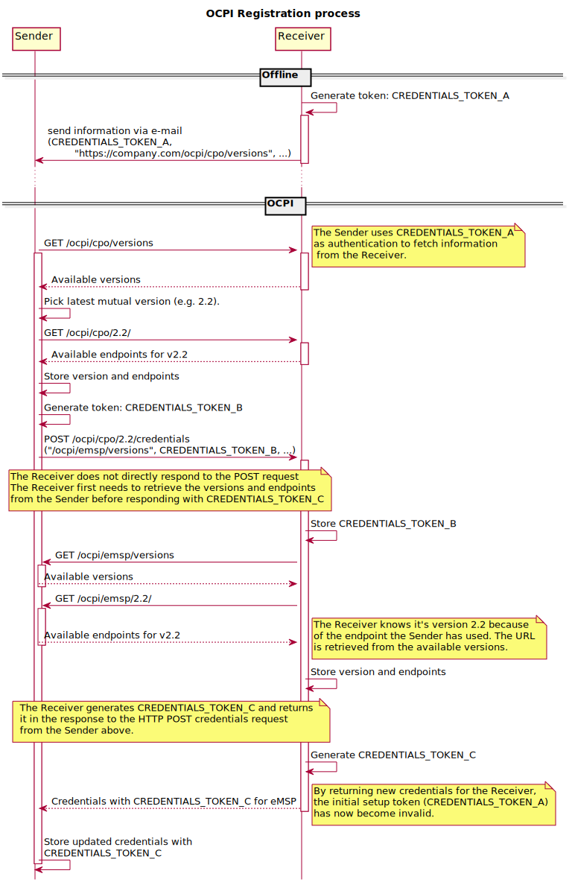
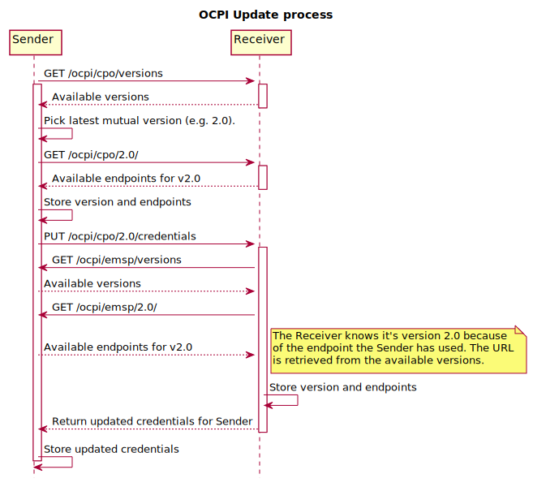

# Use cases

## Registration

To start using OCPI, the Platforms will need to exchange credentials tokens.

To start the exchange of credentials tokens, one platform has to be selected as Sender for the Credentials module. This
has to be decided between the Platforms (outside of OCPI) before they first connect.

To start the credentials exchange, the Receiver Platform must create a unique credentials token: `CREDENTIALS_TOKEN_A`
that has to be used to authorize the Sender until the credentials exchange is finished. This credentials token along
with the versions endpoint SHOULD be sent to the Sender in a secure way that is outside the scope of this protocol.

The Sender starts the registration process, retrieves the version information and details (using `CREDENTIALS_TOKEN_A`
in the HTTP Authorization header). The Sender generates a unique credentials token: `CREDENTIALS_TOKEN_B`, sends it to
the Receiver in a POST request to the `credentials` module of the Receiver. The Receiver stores `CREDENTIALS_TOKEN_B`
and uses it for any requests to the Sender Platform, including the version information and details.

The Receiver generates a unique credentials token: `CREDENTIALS_TOKEN_C` and returns it to the Sender in the response to
the POST request from the Sender.

After the credentials exchange has finished, the Sender SHALL use `CREDENTIALS_TOKEN_C` in future OCPI request to the
Receiver Platform. The `CREDENTIALS_TOKEN_A` can then be thrown away, it MAY no longer be used.

(In the sequence diagrams below we use relative paths as short resource identifiers to illustrate API endpoints; please
note that they should be absolute URLs in any working implementation of OCPI.)

Due to its symmetric nature of the credentials module, any platform can be Sender and or the Receiver for this module.

## Updating to a newer version

At some point, both platforms will have implemented a newer OCPI version. To start using the newer version, one platform
has to send a PUT request to the credentials endpoint of the other platform.

## Changing endpoints for the current version

This can be done by following the update procedure for the same version.

By sending a PUT request to the credentials endpoint of this version, the other platform will fetch and store the
corresponding set of endpoints.

## Updating the credentials and resetting the credentials token

The credentials (or parts thereof, such as the credentials token) can be updated by sending the new credentials via a
PUT request to the credentials endpoint of the current version, similar to the update procedure described above.

Security advices: When one of the connecting platforms suspects that a credentials token is compromised, that platform
SHALL initiate a credentials token update as soon as possible. It is advisable to renew the credentials tokens at least
once a month, in case it was not detected that the credentials where compromised.

## Errors during registration

When the server connects back to the client during the credentials registration, it might encounter problems. When this
happens, the server should add the status code
\<\</docs/ocpi/05-status-codes/05-status-codes.md#3xxx-server-errors,3001\>\> in the response to the POST from the
client.

## Required endpoints not available

When two platforms connect, it might happen that one of the platforms expects a certain endpoint to be available at the
other platform.

For example: a Platform with a CPO role could only want to connect when the CDRs endpoint is available in an platform
with an eMSP role.

In case the Sender (starting the credentials exchange process) cannot find the endpoints it expects, it is expected NOT
to send the POST request with credentials to the Receiver. Log a message/notify the administrator to contact the
administrator of the Receiver platform.

In case the Receiver platform that cannot find the endpoints it expects, then it is expected to respond to the request
with the status code \<\</docs/ocpi/05-status-codes/05-status-codes.md#3xxx-server-errors,3003\>\>.
