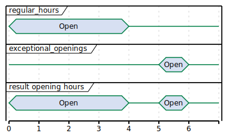

# Data types

## AdditionalGeoLocation *class*

This class defines an additional geo location that is relevant for the Charge Point. The geodetic system to be used is
WGS 84.

| Property  | Type                                                                | Card. | Description                                                                                                                              |
|-----------|---------------------------------------------------------------------|-------|------------------------------------------------------------------------------------------------------------------------------------------|
| latitude  | \<\</docs/ocpi/07-types/01-intro.md#string-type,string\>\>(10)      | 1     | Latitude of the point in decimal degree. Example: 50.770774. Decimal separator: "." Regex: `-?[0-9]{1,2}\.[0-9]{5,7}`                    |
| longitude | \<\</docs/ocpi/07-types/01-intro.md#string-type,string\>\>(11)      | 1     | Longitude of the point in decimal degree. Example: -126.104965. Decimal separator: "." Regex: `-?[0-9]{1,3}\.[0-9]{5,7}`                 |
| name      | \<\</docs/ocpi/07-types/01-intro.md#displaytext-class,DisplayText\> | ?     | Name of the point in local language or as written at the location. For example the street name of a parking lot entrance or it's number. |

## BusinessDetails *class*

| Property | Type                                                                        | Card. | Description                        |
|----------|-----------------------------------------------------------------------------|-------|------------------------------------|
| name     | \<\</docs/ocpi/07-types/01-intro.md#string-type,string\>\>(100)             | 1     | Name of the operator.              |
| website  | \<\</docs/ocpi/07-types/01-intro.md#url-type,URL\>                          | ?     | Link to the operator's website.    |
| logo     | \<\</docs/ocpi/06-modules/03-locations/07-data-types.md#image-class,Image\> | ?     | Image link to the operator's logo. |

## Capability *enum*

The capabilities of an EVSE.

| Value                            | Description                                                                                                                                                                                                                                                                                                |
|----------------------------------|------------------------------------------------------------------------------------------------------------------------------------------------------------------------------------------------------------------------------------------------------------------------------------------------------------|
| CHARGING_PROFILE_CAPABLE         | The EVSE supports charging profiles.                                                                                                                                                                                                                                                                       |
| CHARGING_PREFERENCES_CAPABLE     | The EVSE supports \<\</docs/ocpi/06-modules/04-sessions/06-object-description.md#set-charging-preferences,charging preferences\>\>.                                                                                                                                                                        |
| CHIP_CARD_SUPPORT                | EVSE has a payment terminal that supports chip cards.                                                                                                                                                                                                                                                      |
| CONTACTLESS_CARD_SUPPORT         | EVSE has a payment terminal that supports contactless cards.                                                                                                                                                                                                                                               |
| CREDIT_CARD_PAYABLE              | EVSE has a payment terminal that makes it possible to pay for charging using a credit card.                                                                                                                                                                                                                |
| DEBIT_CARD_PAYABLE               | EVSE has a payment terminal that makes it possible to pay for charging using a debit card.                                                                                                                                                                                                                 |
| PED_TERMINAL                     | EVSE has a payment terminal with a pin-code entry device.                                                                                                                                                                                                                                                  |
| REMOTE_START_STOP_CAPABLE        | The EVSE can remotely be \<\</docs/ocpi/06-modules/08-commands/06-object-description.md#startsession-object,started\>\>/\<\</docs/ocpi/06-modules/08-commands/06-object-description.md#stopsession-object,stopped\>\>.                                                                                     |
| RESERVABLE                       | The EVSE can be \<\</docs/ocpi/06-modules/08-commands/06-object-description.md#reservenow-object,reserved\>\>.                                                                                                                                                                                             |
| RFID_READER                      | Charging at this EVSE can be authorized with an RFID token.                                                                                                                                                                                                                                                |
| START_SESSION_CONNECTOR_REQUIRED | When a \<\</docs/ocpi/06-modules/08-commands/06-object-description.md#startsession-object,StartSession\>is sent to this EVSE, the MSP is required to add the optional `connector_id` field in the \<\</docs/ocpi/06-modules/08-commands/06-object-description.md#startsession-object,StartSession\>object. |
| TOKEN_GROUP_CAPABLE              | This EVSE supports token groups, two or more tokens work as one, so that a session can be started with one token and stopped with another (handy when a card and key-fob are given to the EV-driver).                                                                                                      |
| UNLOCK_CAPABLE                   | Connectors have mechanical lock that can be requested by the eMSP to be \<\</docs/ocpi/06-modules/08-commands/06-object-description.md#unlockconnector-object,unlocked\>\>.                                                                                                                                |

When a Charge Point supports ad-hoc payments with a payment terminal, please use a combination of the following values
to explain the possibilities of the terminal: CHIP_CARD_SUPPORT, CONTACTLESS_CARD_SUPPORT, CREDIT_CARD_PAYABLE,
DEBIT_CARD_PAYABLE, PED_TERMINAL.

There are Charge Points in the field that do not yet support OCPP 2.x. If these Charge Points have multiple connectors
per EVSE, the CPO needs to know which connector to start when receiving a
\<\</docs/ocpi/06-modules/08-commands/06-object-description.md#startsession-object,StartSession\>for the given EVSE.
If this is the case, the CPO should set the `START_SESSION_CONNECTOR_REQUIRED` capability on the given EVSE.

## ConnectorFormat *enum*

The format of the connector, whether it is a socket or a plug.

| Value  | Description                                                                         |
|--------|-------------------------------------------------------------------------------------|
| SOCKET | The connector is a socket; the EV user needs to bring a fitting plug.               |
| CABLE  | The connector is an attached cable; the EV users car needs to have a fitting inlet. |

## ConnectorType *enum*

The socket or plug standard of the charging point.

| Value                 | Description                                                                                           |
|-----------------------|-------------------------------------------------------------------------------------------------------|
| CHADEMO               | The connector type is CHAdeMO, DC                                                                     |
| CHAOJI                | The ChaoJi connector. The new generation charging connector, harmonized between CHAdeMO and GB/T. DC. |
| DOMESTIC_A            | Standard/Domestic household, type "A", NEMA 1-15, 2 pins                                              |
| DOMESTIC_B            | Standard/Domestic household, type "B", NEMA 5-15, 3 pins                                              |
| DOMESTIC_C            | Standard/Domestic household, type "C", CEE 7/17, 2 pins                                               |
| DOMESTIC_D            | Standard/Domestic household, type "D", 3 pin                                                          |
| DOMESTIC_E            | Standard/Domestic household, type "E", CEE 7/5 3 pins                                                 |
| DOMESTIC_F            | Standard/Domestic household, type "F", CEE 7/4, Schuko, 3 pins                                        |
| DOMESTIC_G            | Standard/Domestic household, type "G", BS 1363, Commonwealth, 3 pins                                  |
| DOMESTIC_H            | Standard/Domestic household, type "H", SI-32, 3 pins                                                  |
| DOMESTIC_I            | Standard/Domestic household, type "I", AS 3112, 3 pins                                                |
| DOMESTIC_J            | Standard/Domestic household, type "J", SEV 1011, 3 pins                                               |
| DOMESTIC_K            | Standard/Domestic household, type "K", DS 60884-2-D1, 3 pins                                          |
| DOMESTIC_L            | Standard/Domestic household, type "L", CEI 23-16-VII, 3 pins                                          |
| DOMESTIC_M            | Standard/Domestic household, type "M", BS 546, 3 pins                                                 |
| DOMESTIC_N            | Standard/Domestic household, type "N", NBR 14136, 3 pins                                              |
| DOMESTIC_O            | Standard/Domestic household, type "O", TIS 166-2549, 3 pins                                           |
| GBT_AC                | Guobiao GB/T 20234.2 AC socket/connector                                                              |
| GBT_DC                | Guobiao GB/T 20234.3 DC connector                                                                     |
| IEC_60309_2_single_16 | IEC 60309-2 Industrial Connector single phase 16 amperes (usually blue)                               |
| IEC_60309_2_three_16  | IEC 60309-2 Industrial Connector three phases 16 amperes (usually red)                                |
| IEC_60309_2_three_32  | IEC 60309-2 Industrial Connector three phases 32 amperes (usually red)                                |
| IEC_60309_2_three_64  | IEC 60309-2 Industrial Connector three phases 64 amperes (usually red)                                |
| IEC_62196_T1          | IEC 62196 Type 1 "SAE J1772"                                                                          |
| IEC_62196_T1_COMBO    | Combo Type 1 based, DC                                                                                |
| IEC_62196_T2          | IEC 62196 Type 2 "Mennekes"                                                                           |
| IEC_62196_T2_COMBO    | Combo Type 2 based, DC                                                                                |
| IEC_62196_T3A         | IEC 62196 Type 3A                                                                                     |
| IEC_62196_T3C         | IEC 62196 Type 3C "Scame"                                                                             |
| NEMA_5_20             | NEMA 5-20, 3 pins                                                                                     |
| NEMA_6_30             | NEMA 6-30, 3 pins                                                                                     |
| NEMA_6_50             | NEMA 6-50, 3 pins                                                                                     |
| NEMA_10_30            | NEMA 10-30, 3 pins                                                                                    |
| NEMA_10_50            | NEMA 10-50, 3 pins                                                                                    |
| NEMA_14_30            | NEMA 14-30, 3 pins, rating of 30 A                                                                    |
| NEMA_14_50            | NEMA 14-50, 3 pins, rating of 50 A                                                                    |
| PANTOGRAPH_BOTTOM_UP  | On-board Bottom-up-Pantograph typically for bus charging                                              |
| PANTOGRAPH_TOP_DOWN   | Off-board Top-down-Pantograph typically for bus charging                                              |
| TESLA_R               | Tesla Connector "Roadster"-type (round, 4 pin)                                                        |
| TESLA_S               | Tesla Connector "Model-S"-type (oval, 5 pin)                                                          |

## EnergyMix *class*

This type is used to specify the energy mix and environmental impact of the supplied energy at a location or in a
tariff.

| Property            | Type                                                                                                    | Card. | Description                                                                                     |
|---------------------|---------------------------------------------------------------------------------------------------------|-------|-------------------------------------------------------------------------------------------------|
| is_green_energy     | boolean                                                                                                 | 1     | True if 100% from regenerative sources. (CO2 and nuclear waste is zero)                         |
| energy_sources      | \<\</docs/ocpi/06-modules/03-locations/07-data-types.md#energysource-class,EnergySource\>               | \*    | Key-value pairs (enum + percentage) of energy sources of this location's tariff.                |
| environ_impact      | \<\</docs/ocpi/06-modules/03-locations/07-data-types.md#environmentalimpact-class,EnvironmentalImpact\> | \*    | Key-value pairs (enum + percentage) of nuclear waste and CO2 exhaust of this location's tariff. |
| supplier_name       | \<\</docs/ocpi/07-types/01-intro.md#string-type,string\>\>(64)                                          | ?     | Name of the energy supplier, delivering the energy for this location or tariff.\*               |
| energy_product_name | \<\</docs/ocpi/07-types/01-intro.md#string-type,string\>\>(64)                                          | ?     | Name of the energy suppliers product/tariff plan used at this location.\*                       |

*\* These fields can be used to look up energy qualification or to show it directly to the customer (for well-known
brands like Greenpeace Energy, etc.)*

### Examples

#### Simple

```json
{
  "energy_mix": {
    "is_green_energy": true
  }
}
```

#### Tariff energy provider name

```json
{
  "energy_mix": {
    "is_green_energy": true,
    "supplier_name": "Greenpeace Energy eG",
    "energy_product_name": "eco-power"
  }
}
```

#### Complete

```json
{
  "energy_mix": {
    "is_green_energy": false,
    "energy_sources": [
      {
        "source": "GENERAL_GREEN",
        "percentage": 35.9
      },
      {
        "source": "GAS",
        "percentage": 6.3
      },
      {
        "source": "COAL",
        "percentage": 33.2
      },
      {
        "source": "GENERAL_FOSSIL",
        "percentage": 2.9
      },
      {
        "source": "NUCLEAR",
        "percentage": 21.7
      }
    ],
    "environ_impact": [
      {
        "category": "NUCLEAR_WASTE",
        "amount": 0.0006
      },
      {
        "category": "CARBON_DIOXIDE",
        "amount": 372
      }
    ],
    "supplier_name": "E.ON Energy Deutschland",
    "energy_product_name": "E.ON DirektStrom eco"
  }
}
```

## EnergySource *class*

Key-value pairs (enum + percentage) of energy sources. All given values of all categories should add up to 100 percent.

| Property   | Type                                                                                                     | Card. | Description                                   |
|------------|----------------------------------------------------------------------------------------------------------|-------|-----------------------------------------------|
| source     | \<\</docs/ocpi/06-modules/03-locations/07-data-types.md#energysourcecategory-enum,EnergySourceCategory\> | 1     | The type of energy source.                    |
| percentage | \<\</docs/ocpi/07-types/01-intro.md#number-type,number\>                                                 | 1     | Percentage of this source (0-100) in the mix. |

## EnergySourceCategory *enum*

Categories of energy sources.

| Value          | Description                              |
|----------------|------------------------------------------|
| NUCLEAR        | Nuclear power sources.                   |
| GENERAL_FOSSIL | All kinds of fossil power sources.       |
| COAL           | Fossil power from coal.                  |
| GAS            | Fossil power from gas.                   |
| GENERAL_GREEN  | All kinds of regenerative power sources. |
| SOLAR          | Regenerative power from PV.              |
| WIND           | Regenerative power from wind turbines.   |
| WATER          | Regenerative power from water turbines.  |

## EnvironmentalImpact *class*

Amount of waste produced/emitted per kWh.

| Property | Type                                                                                                                   | Card. | Description                                      |
|----------|------------------------------------------------------------------------------------------------------------------------|-------|--------------------------------------------------|
| category | \<\</docs/ocpi/06-modules/03-locations/07-data-types.md#environmentalimpactcategory-enum,EnvironmentalImpactCategory\> | 1     | The environmental impact category of this value. |
| amount   | \<\</docs/ocpi/07-types/01-intro.md#number-type,number\>                                                               | 1     | Amount of this portion in g/kWh.                 |

## EnvironmentalImpactCategory *enum*

Categories of environmental impact values.

| Value          | Description                                         |
|----------------|-----------------------------------------------------|
| NUCLEAR_WASTE  | Produced nuclear waste in grams per kilowatthour.   |
| CARBON_DIOXIDE | Exhausted carbon dioxide in grams per kilowatthour. |

## ExceptionalPeriod *class*

Specifies one exceptional period for opening or access hours.

| Property     | Type                                                         | Card. | Description                                                                             |
|--------------|--------------------------------------------------------------|-------|-----------------------------------------------------------------------------------------|
| period_begin | \<\</docs/ocpi/07-types/01-intro.md#datetime-type,DateTime\> | 1     | Begin of the exception. In UTC, `time_zone` field can be used to convert to local time. |
| period_end   | \<\</docs/ocpi/07-types/01-intro.md#datetime-type,DateTime\> | 1     | End of the exception. In UTC, `time_zone` field can be used to convert to local time.   |

## Facility *enum*

| Value           | Description                                          |
|-----------------|------------------------------------------------------|
| HOTEL           | A hotel.                                             |
| RESTAURANT      | A restaurant.                                        |
| CAFE            | A cafe.                                              |
| MALL            | A mall or shopping center.                           |
| SUPERMARKET     | A supermarket.                                       |
| SPORT           | Sport facilities: gym, field etc.                    |
| RECREATION_AREA | A recreation area.                                   |
| NATURE          | Located in, or close to, a park, nature reserve etc. |
| MUSEUM          | A museum.                                            |
| BIKE_SHARING    | A bike/e-bike/e-scooter sharing location.            |
| BUS_STOP        | A bus stop.                                          |
| TAXI_STAND      | A taxi stand.                                        |
| TRAM_STOP       | A tram stop/station.                                 |
| METRO_STATION   | A metro station.                                     |
| TRAIN_STATION   | A train station.                                     |
| AIRPORT         | An airport.                                          |
| PARKING_LOT     | A parking lot.                                       |
| CARPOOL_PARKING | A carpool parking.                                   |
| FUEL_STATION    | A Fuel station.                                      |
| WIFI            | Wifi or other type of internet available.            |

## GeoLocation *class*

This class defines the geo location of the Charge Point. The geodetic system to be used is WGS 84.

| Property  | Type                                                           | Card. | Description                                                                                                              |
|-----------|----------------------------------------------------------------|-------|--------------------------------------------------------------------------------------------------------------------------|
| latitude  | \<\</docs/ocpi/07-types/01-intro.md#string-type,string\>\>(10) | 1     | Latitude of the point in decimal degree. Example: 50.770774. Decimal separator: "." Regex: `-?[0-9]{1,2}\.[0-9]{5,7}`    |
| longitude | \<\</docs/ocpi/07-types/01-intro.md#string-type,string\>\>(11) | 1     | Longitude of the point in decimal degree. Example: -126.104965. Decimal separator: "." Regex: `-?[0-9]{1,3}\.[0-9]{5,7}` |

:::note
Five decimal places is seen as a minimum for GPS coordinates of the Charge Point as this gives approximately 1 meter
precision. More is always better. Seven decimal places gives approximately 1cm precision.
:::

## Hours *class*

Opening and access hours of the location.

| Property             | Type                                                                                                | Card. | Description                                                                                                                                                                                                              |
|----------------------|-----------------------------------------------------------------------------------------------------|-------|--------------------------------------------------------------------------------------------------------------------------------------------------------------------------------------------------------------------------|
| twentyfourseven      | boolean                                                                                             | 1     | True to represent 24 hours a day and 7 days a week, except the given exceptions.                                                                                                                                         |
| regular_hours        | \<\</docs/ocpi/06-modules/03-locations/07-data-types.md#regularhours-class,RegularHours\>           | \*    | Regular hours, weekday-based. Only to be used if `twentyfourseven=false`, then this field needs to contain at least one \<\</docs/ocpi/06-modules/03-locations/07-data-types.md#regularhours-class,RegularHours\>object. |
| exceptional_openings | \<\</docs/ocpi/06-modules/03-locations/07-data-types.md#exceptionalperiod-class,ExceptionalPeriod\> | \*    | Exceptions for specified calendar dates, time-range based. Periods the station is operating/accessible. Additional to `regular_hours`. May overlap regular rules.                                                        |
| exceptional_closings | \<\</docs/ocpi/06-modules/03-locations/07-data-types.md#exceptionalperiod-class,ExceptionalPeriod\> | \*    | Exceptions for specified calendar dates, time-range based. Periods the station is not operating/accessible. Overwriting `regular_hours` and `exceptional_openings`. Should not overlap `exceptional_openings`.           |

### Example: 24/7 open with exceptional closing

Open 24 hours per day, 7 days a week, except for 25th of December 2018 between 03:00 and 05:00.

```json
{
  "twentyfourseven": true,
  "exceptional_closings": [
    {
      "period_begin": "2018-12-25T03:00:00Z",
      "period_end": "2018-12-25T05:00:00Z"
    }
  ]
}
```


### Example: Opening Hours with exceptional closing

Regular opening hours between 01:00 and 06:00. With exceptional closing on 25th of December 2018 between 03:00 and
05:00.

```json
{
  "twentyfourseven": false,
  "regular_hours": [
    {
      "weekday": 1,
      "period_begin": "01:00",
      "period_end": "06:00"
    },
    {
      "weekday": 2,
      "period_begin": "01:00",
      "period_end": "06:00"
    }
  ],
  "exceptional_closings": [
    {
      "period_begin": "2018-12-25T03:00:00Z",
      "period_end": "2018-12-25T05:00:00Z"
    }
  ]
}
```


### Example: Opening Hours with exceptional opening

Regular opening hours between 00:00 and 04:00. With exceptional opening on 25th of December 2018 between 05:00 and
07:00.

```json
{
  "twentyfourseven": false,
  "regular_hours": [
    {
      "weekday": 1,
      "period_begin": "00:00",
      "period_end": "04:00"
    },
    {
      "weekday": 2,
      "period_begin": "00:00",
      "period_end": "04:00"
    }
  ],
  "exceptional_openings": [
    {
      "period_begin": "2018-12-25T05:00:00Z",
      "period_end": "2018-12-25T06:00:00Z"
    }
  ]
}
```



## Image *class*

This class references an image related to an EVSE in terms of a file name or url. According to the roaming connection
between one EVSE Operator and one or more Navigation Service Providers, the hosting or file exchange of image payload
data has to be defined. The exchange of this content data is out of scope of OCPI. However, the recommended setup is a
public available web server hosted and updated by the EVSE Operator. Per charge point an unlimited number of images of
each type is allowed. Recommended are at least two images where one is a network or provider logo and the second is a
station photo. If two images of the same type are defined, not only one should be selected but both should be displayed
together.

Photo Dimensions: The recommended dimensions for all photos is a minimum width of 800 pixels and a minimum height of 600
pixels. Thumbnail should always have the same orientation as the original photo with a size of 200 by 200 pixels.

Logo Dimensions: The recommended dimensions for logos are exactly 512 pixels in width height. Thumbnail representations
of logos should be exactly 128 pixels in width and height. If not squared, thumbnails should have the same orientation
as the original.

| Property  | Type                                                                                       | Card. | Description                                                                  |
|-----------|--------------------------------------------------------------------------------------------|-------|------------------------------------------------------------------------------|
| url       | \<\</docs/ocpi/07-types/01-intro.md#url-type,URL\>                                         | 1     | URL from where the image data can be fetched through a web browser.          |
| thumbnail | \<\</docs/ocpi/07-types/01-intro.md#url-type,URL\>                                         | ?     | URL from where a thumbnail of the image can be fetched through a webbrowser. |
| category  | \<\</docs/ocpi/06-modules/03-locations/07-data-types.md#imagecategory-enum,ImageCategory\> | 1     | Describes what the image is used for.                                        |
| type      | \<\</docs/ocpi/07-types/01-intro.md#string-type,CiString\>\>(4)                            | 1     | Image type like: gif, jpeg, png, svg.                                        |
| width     | int(5)                                                                                     | ?     | Width of the full scale image.                                               |
| height    | int(5)                                                                                     | ?     | Height of the full scale image.                                              |

## ImageCategory *enum*

The category of an image to obtain the correct usage in a user presentation. The category has to be set accordingly to
the image content in order to guarantee the right usage.

| Value    | Description                                                                                                                                                                |
|----------|----------------------------------------------------------------------------------------------------------------------------------------------------------------------------|
| CHARGER  | Photo of the physical device that contains one or more EVSEs.                                                                                                              |
| ENTRANCE | Location entrance photo. Should show the car entrance to the location from street side.                                                                                    |
| LOCATION | Location overview photo.                                                                                                                                                   |
| NETWORK  | Logo of an associated roaming network to be displayed with the EVSE for example in lists, maps and detailed information views.                                             |
| OPERATOR | Logo of the charge point operator, for example a municipality, to be displayed in the EVSEs detailed information view or in lists and maps, if no network logo is present. |
| OTHER    | Other                                                                                                                                                                      |
| OWNER    | Logo of the charge point owner, for example a local store, to be displayed in the EVSEs detailed information view.                                                         |

## ParkingRestriction *enum*

This value, if provided, represents the restriction to the parking spot for different purposes.

| Value       | Description                                                                     |
|-------------|---------------------------------------------------------------------------------|
| EV_ONLY     | Reserved parking spot for electric vehicles.                                    |
| PLUGGED     | Parking is only allowed while plugged in (charging).                            |
| DISABLED    | Reserved parking spot for disabled people with valid ID.                        |
| CUSTOMERS   | Parking spot for customers/guests only, for example in case of a hotel or shop. |
| MOTORCYCLES | Parking spot only suitable for (electric) motorcycles or scooters.              |

## ParkingType *enum*

Reflects the general type of the charge point's location. May be used for user information.

| Value              | Description                                                                                  |
|--------------------|----------------------------------------------------------------------------------------------|
| ALONG_MOTORWAY     | Location on a parking facility/rest area along a motorway, freeway, interstate, highway etc. |
| PARKING_GARAGE     | Multistorey car park.                                                                        |
| PARKING_LOT        | A cleared area that is intended for parking vehicles, i.e. at super markets, bars, etc.      |
| ON_DRIVEWAY        | Location is on the driveway of a house/building.                                             |
| ON_STREET          | Parking in public space along a street.                                                      |
| UNDERGROUND_GARAGE | Multistorey car park, mainly underground.                                                    |

## PowerType *enum*

| Value            | Description                                                      |
|------------------|------------------------------------------------------------------|
| AC_1_PHASE       | AC single phase.                                                 |
| AC_2_PHASE       | AC two phases, only two of the three available phases connected. |
| AC_2_PHASE_SPLIT | AC two phases using split phase system.                          |
| AC_3_PHASE       | AC three phases.                                                 |
| DC               | Direct Current.                                                  |

## PublishTokenType *class*

Defines the set of values that identify a token to which a Location might be published.

At least one of the following fields SHALL be set: `uid`, `visual_number`, or `group_id`.

When `uid` is set, `type` SHALL also be set.

When `visual_number` is set, `issuer` SHALL also be set.

| Property      | Type                                                                            | Card. | Description                                                                                                            |
|---------------|---------------------------------------------------------------------------------|-------|------------------------------------------------------------------------------------------------------------------------|
| uid           | \<\</docs/ocpi/07-types/01-intro.md#cistring-type,CiString\>\>(36)              | ?     | Unique ID by which this Token can be identified.                                                                       |
| type          | \<\</docs/ocpi/06-modules/07-tokens/07-data-types.md#tokentype-enum,TokenType\> | ?     | Type of the token.                                                                                                     |
| visual_number | \<\</docs/ocpi/07-types/01-intro.md#string-type,string\>\>(64)                  | ?     | Visual readable number/identification as printed on the Token (RFID card).                                             |
| issuer        | \<\</docs/ocpi/07-types/01-intro.md#string-type,string\>\>(64)                  | ?     | Issuing company, most of the times the name of the company printed on the token (RFID card), not necessarily the eMSP. |
| group_id      | \<\</docs/ocpi/07-types/01-intro.md#cistring-type,CiString\>\>(36)              | ?     | This ID groups a couple of tokens. This can be used to make two or more tokens work as one.                            |

## RegularHours *class*

Regular recurring operation or access hours.

| Property     | Type                                                          | Card. | Description                                                                                                                                                                                                         |
|--------------|---------------------------------------------------------------|-------|---------------------------------------------------------------------------------------------------------------------------------------------------------------------------------------------------------------------|
| weekday      | int(1)                                                        | 1     | Number of day in the week, from Monday (1) till Sunday (7)                                                                                                                                                          |
| period_begin | \<\</docs/ocpi/07-types/01-intro.md#string-type,string\>\>(5) | 1     | Begin of the regular period, in local time, given in hours and minutes. Must be in 24h format with leading zeros. Example: "18:15". Hour/Minute separator: ":" Regex: [Regex Test](https://regex101.com/r/xaMwu6/1) |
| period_end   | \<\</docs/ocpi/07-types/01-intro.md#string-type,string\>\>(5) | 1     | End of the regular period, in local time, syntax as for `period_begin`. Must be later than `period_begin`.                                                                                                          |

### Example

Operating on weekdays from 8am till 8pm with one exceptional opening on 22/6/2014 and one exceptional closing the Monday
after:

```json
{
  "opening_times": {
    "regular_hours": [
      {
        "weekday": 1,
        "period_begin": "08:00",
        "period_end": "20:00"
      },
      {
        "weekday": 2,
        "period_begin": "08:00",
        "period_end": "20:00"
      },
      {
        "weekday": 3,
        "period_begin": "08:00",
        "period_end": "20:00"
      },
      {
        "weekday": 4,
        "period_begin": "08:00",
        "period_end": "20:00"
      },
      {
        "weekday": 5,
        "period_begin": "08:00",
        "period_end": "20:00"
      }
    ],
    "twentyfourseven": false,
    "exceptional_openings": [
      {
        "period_begin": "2014-06-21T09:00:00Z",
        "period_end": "2014-06-21T12:00:00Z"
      }
    ],
    "exceptional_closings": [
      {
        "period_begin": "2014-06-24T00:00:00Z",
        "period_end": "2014-06-25T00:00:00Z"
      }
    ]
  }
}
```

This represents the following schedule, where ~~stroked out~~ days are without operation
hours, **bold** days are where exceptions apply and regular displayed days are where the regular schedule applies.

| Weekday   | Mo | Tu | We | Th | Fr | Sa     | Su     | Mo | Tu         | We | Th | Fr | Sa     | Su     |
|-----------|----|----|----|----|----|--------|--------|----|------------|----|----|----|--------|--------|
| Date      | 16 | 17 | 18 | 19 | 20 | **21** | ~~22~~ | 23 | **~~24~~** | 25 | 26 | 27 | ~~28~~ | ~~29~~ |
| Open from | 08 | 08 | 08 | 08 | 08 | 09     | -      | 08 | -          | 08 | 08 | 08 | -      | -      |
| Open till | 20 | 20 | 20 | 20 | 20 | 12     | -      | 20 | -          | 20 | 20 | 20 | -      | -      |

## Status *enum*

The status of an EVSE.

| Value       | Description                                                                                           |
|-------------|-------------------------------------------------------------------------------------------------------|
| AVAILABLE   | The EVSE/Connector is able to start a new charging session.                                           |
| BLOCKED     | The EVSE/Connector is not accessible because of a physical barrier, i.e. a car.                       |
| CHARGING    | The EVSE/Connector is in use.                                                                         |
| INOPERATIVE | The EVSE/Connector is not yet active, or temporarily not available for use, but not broken or defect. |
| OUTOFORDER  | The EVSE/Connector is currently out of order, some part/components may be broken/defect.              |
| PLANNED     | The EVSE/Connector is planned, will be operating soon.                                                |
| REMOVED     | The EVSE/Connector was discontinued/removed.                                                          |
| RESERVED    | The EVSE/Connector is reserved for a particular EV driver and is unavailable for other drivers.       |
| UNKNOWN     | No status information available (also used when offline).                                             |

## StatusSchedule *class*

This type is used to schedule status periods in the future. The eMSP can provide this information to the EV user for
trip planning purposes. A period MAY have no end. Example: "This station will be running as of tomorrow. Today it is
still planned and under construction."

| Property     | Type                                                                         | Card. | Description                               |
|--------------|------------------------------------------------------------------------------|-------|-------------------------------------------|
| period_begin | \<\</docs/ocpi/07-types/01-intro.md#datetime-type,DateTime\>                 | 1     | Begin of the scheduled period.            |
| period_end   | \<\</docs/ocpi/07-types/01-intro.md#datetime-type,DateTime\>                 | ?     | End of the scheduled period, if known.    |
| status       | \<\</docs/ocpi/06-modules/03-locations/07-data-types.md#status-enum,Status\> | 1     | Status value during the scheduled period. |

:::note
The scheduled status is purely informational. When the status actually changes, the CPO must push an update to the EVSEs
`status` field itself.
